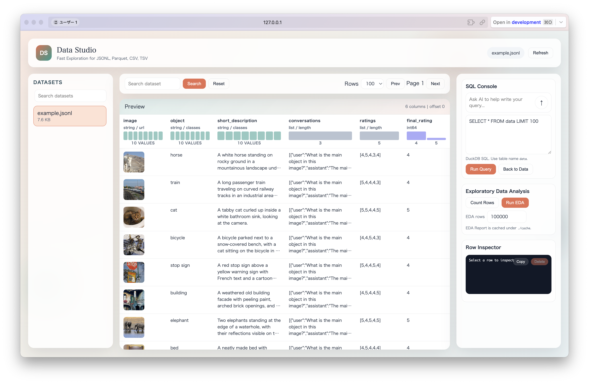
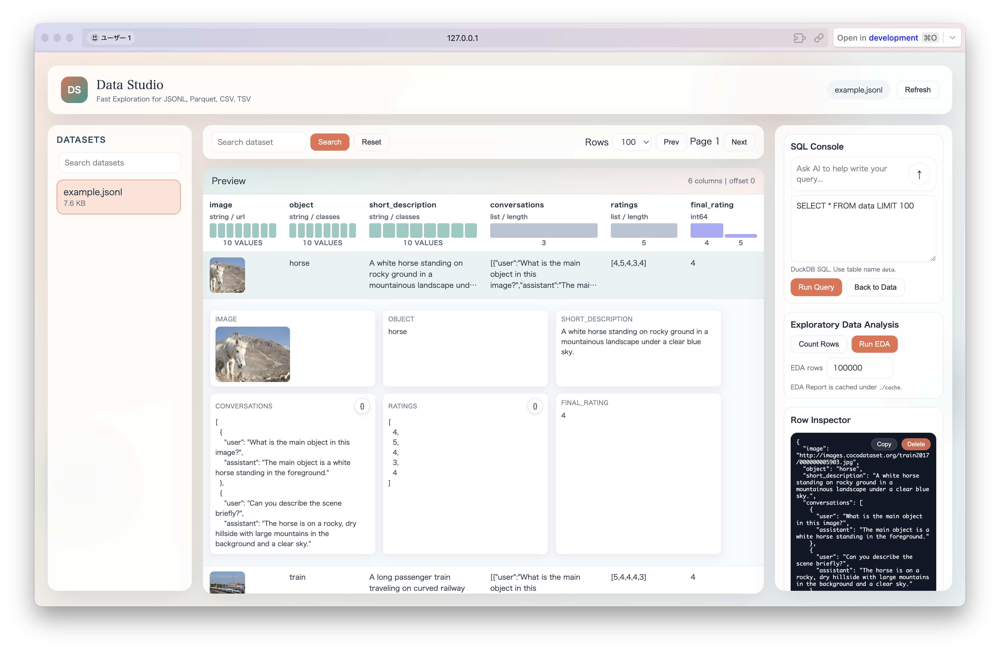

<div align="center">

# Local Data Studio

**GUI Application for Local Dataset Viewing and Analysis**

English | [日本語](docs/README_ja.md)
</div>

Local Data Studio is a Web Viewer for browsing and analyzing JSONL/JSON/CSV/TSV/Parquet files locally, inspired by Hugging Face Datasets' [Data Studio](https://huggingface.co/docs/hub/data-studio#data-studio).  
It provides fast preview, DuckDB SQL execution (with optional LLM-assisted SQL generation), basic statistics, and EDA report generation.

<div align="center">

</div>

## Key Features

- Fast preview and paging for large-scale datasets
- DuckDB SQL console (read-only)
- EDA report generation (cached under `./cache`)
- Row Inspector (copy, delete, highlight)
- Image zoom and multi-image navigation
- Drag & drop upload support
- Hide/delete within the current session

## Setup

1. **Clone or download the repository**

    ```bash
    git clone git@github.com:Onely7/local_data_studio.git
    cd local_data_studio
    ```

2. **Install dependencies**

    ```bash
    uv sync
    ```

3. **Configure environment variables**
   Create or edit `.env` and set the environment variables.

    ```bash
    cp .env.example .env
    ```

    ```bash
    # Data set specification (if both exist, DATA_FILE takes precedence)
    # DATA_FILE=
    DATA_DIR=/local/data/path  # FIXME: data directory path set here (required)

    # LLM SQL Generation Settings
    OPENAI_API_KEY=""  # FIXME: OpenAI API Key set here
    OPENAI_BASE_URL=https://api.openai.com/v1
    OPENAI_MODEL=gpt-5.2

    # EDA Settings
    EDA_ROW_LIMIT=10000000
    # EDA_FONT_FAMILY=IPAexGothic
    # EDA_FONT_PATH=fonts/ipaexg.ttf
    EDA_PROFILE_MODE=minimal
    EDA_CELL_MAX_CHARS=5000
    EDA_NESTED_POLICY=stringify

    # Delete Permission
    ALLOW_DELETE_DATA=false
    ```

   Environment variable details:

   - `DATA_FILE`: Directly specify a single file. If set, it takes precedence over `DATA_DIR`.
   - `DATA_DIR`: Directory to search for datasets (required if `DATA_FILE` is not used).
   - `OPENAI_API_KEY`: API key to enable LLM-based SQL generation.
   - `OPENAI_BASE_URL`: Endpoint for an OpenAI-compatible API.
   - `OPENAI_MODEL`: OpenAI model name to use.
   - `EDA_ROW_LIMIT`: Maximum number of rows to load when generating an EDA report.
   - `EDA_FONT_FAMILY`: Font family name used in EDA reports. (Optional)
   - `EDA_FONT_PATH`: Path to a font file (takes precedence if set). (Optional)
   - `EDA_PROFILE_MODE`: Either `minimal` or `maximal`. `minimal` generates a lightweight report, while `maximal` includes more detailed statistics but takes longer.
   - `EDA_CELL_MAX_CHARS`: Maximum number of characters to display for long strings in EDA. Excess text is truncated as `... (truncated)`.
   - `EDA_NESTED_POLICY`: How to handle nested types (list/struct/object/binary, etc.). `stringify` keeps them as strings, and `drop` removes the corresponding columns.
   - `ALLOW_DELETE_DATA`: If `false`, physical file deletion is disabled (session-level hiding is still allowed).

## Run

```bash
uv run uvicorn app:app --reload
```

After running, you will see messages like the following in your terminal:

```
INFO:     Will watch for changes in these directories: ['local/data_viewer']
INFO:     Uvicorn running on http://127.0.0.1:8000 (Press CTRL+C to quit)
INFO:     Started reloader process [00000] using StatReload
INFO:     Started server process [00000]
INFO:     Waiting for application startup.
INFO:     Application startup complete.
```

The Local Data Studio server is now running.  
Open [http://127.0.0.1:8000](http://127.0.0.1:8000) to view the Local Data Studio GUI.

## Usage

1. **Select a file from DATASETS**
   Choose a dataset from the DATASETS list on the left. You can also filter by using the search box.

2. **Preview / Search / Paging**
   Use Search at the top to search the data, Rows to change the number of displayed rows, and Prev/Next to move between pages.

3. **SQL Console**
   Run DuckDB SQL queries against the `data` table.  
   It also supports converting natural-language instructions into SQL using an LLM.

4. **EDA Report**
   Run EDA to generate and cache a report.  
   Reports are cached under `./cache` based on {file name, number of samples, `EDA_PROFILE_MODE`}.  
   You can adjust the sample count with `EDA_ROW_LIMIT` and UI-side settings.

5. **Row Inspector / Image Zoom**
   Click a row to expand it in the details panel. For image columns, click to open a zoomed view.  
   

## Notes

- Supported dataset formats: `.jsonl`, `.json`, `.csv`, `.tsv`, `.parquet`.
- On large datasets, searching and running EDA may take time.
- `Delete from file` modifies the actual file, so make backups as needed.
- If `ALLOW_DELETE_DATA=false`, only session-level hiding is allowed (the actual file will not be modified).

## Contribution

- Please use Issues for bug reports and feature requests.
- This repository uses pre-commit for code quality. Running `uv run pre-commit run --all-files` (or `uvx pre-commit run --all-files`) is equivalent to executing the following:

  - `uv run ruff format` (or `uvx ruff format`)
  - `uv run ruff check` (or `uvx ruff check`)
  - `uv run pyrefly check` (or `uvx pyrefly check`)
- Please make sure to fix all reported errors before committing.

## Acknowledgements

- [Dataset viewer (Huggingface)](https://github.com/huggingface/dataset-viewer): Used as a reference for UI/feature design.
- [Zarque-profiling](https://github.com/crescendo-medix/zarque-profiling): Used for EDA report generation.

## License

This repository is released under the MIT License.
