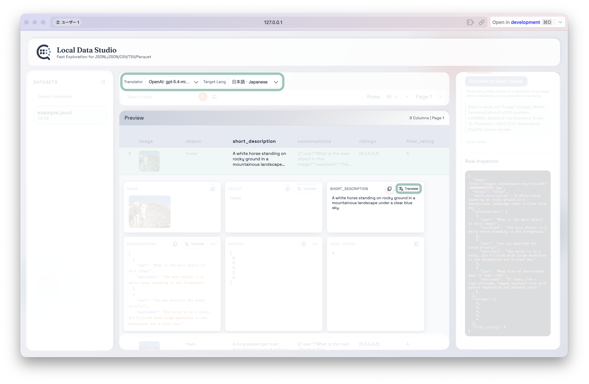
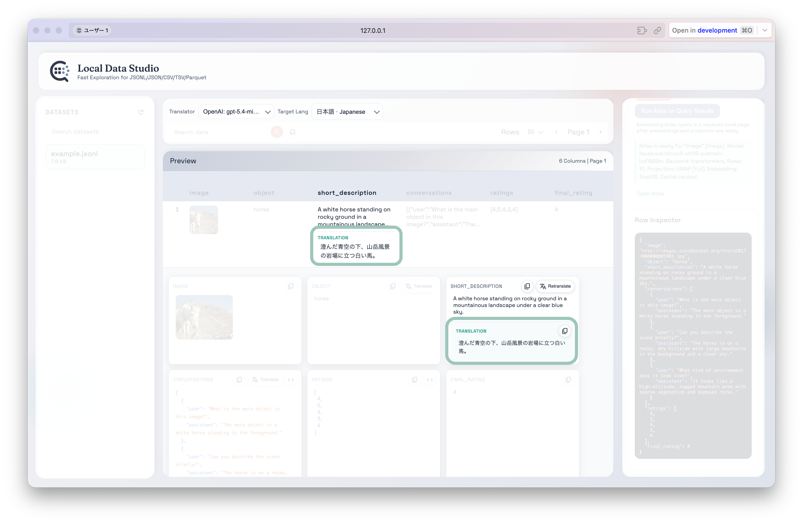

<div align="center">

# Local Data Studio 

**An application for browsing and analyzing local datasets in your browser**

English | [日本語](docs/README_ja.md)

</div>

Local Data Studio lets you browse, search, and analyze local data in JSONL, JSON, CSV, TSV, and Parquet formats directly in your browser.
It was inspired by [Data Studio from Hugging Face Datasets](https://huggingface.co/docs/hub/data-studio#data-studio).

In addition to previewing data, you can search and aggregate it with SQL, generate EDA reports that summarize its characteristics, and visualize embeddings with Embedding Atlas.
An embedding is a numeric representation of the features of text or an image.
When an LLM (large language model) is configured, you can also generate SQL from natural-language instructions and translate values currently displayed in the application.

If this is your first time using Local Data Studio, we recommend starting with [Quick Start](#quick-start) and [Basic Usage](#basic-usage).
Detailed settings and implementation notes are collected in collapsible sections later in this document.
Click the Local Data Studio logo in the top bar to open this GitHub repository in a new tab.

<div align="center">

</div>

## Key Features

* Preview large datasets while limiting how much data is loaded
* Run read-only searches and aggregations with DuckDB SQL
* Apply SQL timeouts, memory limits, and warnings when a query may read a large amount of data
* Generate EDA reports for an entire dataset or SQL results
* Visualize text columns, image columns, or SQL results with Embedding Atlas
* Inspect complete row contents with the **Row Inspector**
* Display images from URLs, local file paths, and values stored in `{bytes, path}` format
* Open enlarged image previews and switch between multiple images in the same row
* Manually translate visible cells or columns with configured LiteLLM-compatible models
* Upload files by dragging and dropping them into the application
* Hide rows while the application page is open and, when needed, delete them from the source file

## Supported Environments and Data Formats

* Python 3.11, 3.12, or 3.13
* Supported formats: `.jsonl`, `.json`, `.csv`, `.tsv`, and `.parquet`

## Quick Start

For regular use, the simplest option is to install the package from PyPI, the service used to distribute Python packages.

### 1. Install Local Data Studio

```bash
pip install local-data-studio
```

### 2. Start the Application with Your Data

To list the supported files in a directory, start the application as follows:

```bash
local-data-studio --data-dir /local/data/path
```

Replace `/local/data/path` with the path to the directory that contains the data you want to inspect.
A path is a string that identifies the location of a file or directory.

You can run the same operation through the Python module entry point:

```bash
python -m local_data_studio --data-dir /local/data/path
```

To open a single file instead of a directory, use `--data-file` instead of `--data-dir`:

```bash
local-data-studio --data-file /local/data/example.parquet
```

### 3. Open the Application in Your Browser

After the application starts, open <http://127.0.0.1:8000> in your browser.
Normally, you open this address on the same computer where Local Data Studio is running.

### 4. Stop the Application

Press `Ctrl+C` in the terminal where Local Data Studio is running.

## Basic Usage

### 1. Select a Data File

Select the file you want to inspect from the **DATASETS** list on the left.
You can also use the search box to filter the list by file name.

Long file names are shortened in the list.
File sizes are displayed with up to three significant digits using the most appropriate unit: `Bytes`, `kB`, `MB`, `GB`, or `TB`.


### 2. Browse and Search Data

Use the controls at the top of the page to change what is displayed:

* **Search**: Searches the data.
* **Rows**: Changes the number of rows shown per page.
* **Prev** / **Next**: Moves to the previous or next page.


### 3. Use the SQL Console

SQL is a language used to search and aggregate data.
In the Local Data Studio SQL console, the selected dataset is available as a table named `data`, and you can run DuckDB SQL against it.
Only read-only queries, meaning SQL statements that do not modify the data, are allowed.

If the server has a LiteLLM model connection setting, called a model profile, you can generate SQL from natural-language instructions.
You can choose from configured OpenAI, Anthropic, Gemini, hosted vLLM, and other LiteLLM-compatible models.

SQL execution is subject to timeouts, memory limits, and checks for queries that may read a large amount of data.
For restrictions on generated SQL, see [LLM Model Profiles for SQL Generation and Translation](#llm-model-profiles-for-sql-generation-and-translation).


### 4. Generate an EDA Report

An EDA (exploratory data analysis) report summarizes characteristics of the data, such as column types, value distributions, and missing values.

Select **Run EDA** to generate a report from rows loaded from the dataset.
Generated reports are stored in a cache, which is a storage area used to reuse previously generated results.
As a result, a report may be reused when you run it again under the same conditions.

Select **Run EDA on Query Results** to generate a report from the current results displayed in the SQL console.

Set the maximum number of rows to load with `eda_row_limit` in the `[settings]` section of `local_data_studio.toml`, or with the `EDA_ROW_LIMIT` environment variable in the operating system or `.env` file.
This value cannot be changed from the application screen.
Any integer greater than or equal to `1` is accepted; use `-1` to remove the row limit.

The **Profile mode** option in the EDA panel controls the level of detail for each run.
The default value is `minimal`.

 

### 5. Visualize Embeddings

An embedding represents the features of text or an image as a sequence of numbers called a vector.
Embeddings usually contain many numbers, which makes them difficult to compare directly on a screen.
Local Data Studio uses methods such as UMAP, t-SNE, and PCA to convert embeddings into two-dimensional coordinates and displays them with Embedding Atlas.
This conversion is called **dimensionality reduction**.
Some configuration keys and internal code use the term `projection`, but this README uses **dimensionality reduction** as the general term for UMAP, t-SNE, and PCA.

To use this feature, you must provide a local encoder model in Hugging Face format.
Hugging Face format means that the model's configuration files and related data are stored in the expected directory structure.
An encoder model converts text or images into embeddings.

Place the model under `models/embedder`, or under the directory specified by `--models-dir` or `EMBEDDER_MODELS_DIR`.

Example locations:

```text
models/embedder/google/siglip2-base-patch16-224
models/embedder/Qwen/Qwen3-Embedding-0.6B
models/embedder/Qwen/Qwen3-VL-Embedding-2B
```

A directory appears in the **Model** selector when it contains model-identifying files such as `config.json`, `modules.json`, `tokenizer_config.json`, or `preprocessor_config.json`.

Under **Visualize Embedding**, select the following:

1. A text or image column
2. The model to use
3. The library that loads the model and computes embeddings, referred to as the backend
4. The dimensionality-reduction method used to convert embeddings into two dimensions

Available dimensionality-reduction methods are **UMAP** (default), **t-SNE**, and **PCA**.
Select **Run Atlas** to start an Embedding Atlas page for the dataset.
Select **Run Atlas on Query Results** to visualize the current SQL results instead.

When listing models, Local Data Studio inspects configuration files without loading the large model data known as weights.
Unavailable backends are still shown in the list but cannot be selected.
When both Sentence Transformers and Transformers are supported, Sentence Transformers is selected initially.

The operation runs as a background job so that you can continue using the application.
Progress is shown for each processing phase and is updated whenever a batch, meaning a fixed group of rows, finishes.
Cancellation takes effect after the current batch or processing phase finishes.

When preparation is complete, an **Open Atlas** link appears.

<details>
<summary><strong>Using the Sentence Transformers Prompt</strong></summary>

When Sentence Transformers is selected, a **Prompt** field appears for entering additional instructions for the model.
If the field is left empty, the default prompt stored with the model is used.

* Text without a placeholder is prepended to each value in the selected column.
* Placeholders such as `{title}` and `{body}` are replaced with values from the corresponding columns in the same dataset row or SQL result row.
* `{{` and `}}` are treated as literal braces.
* Missing columns, unsupported conversions or format specifications, and unmatched braces are rejected before the model is loaded.

</details>

 

### 6. Use the Row Inspector and Enlarged Image View

Click a row to display the full contents of each column in the **Row Inspector**.
Long values are shortened initially, but you can switch to **Raw** to view the complete value.

On desktop-sized viewports, the dataset list, Preview, and inspector are arranged at the same height and scroll independently within their own regions.
On mobile and tablet layouts, the entire page scrolls vertically and the **DATASETS** block appears directly below the title bar.

Values recognized as images can be clicked to open an enlarged preview.
The following formats are supported:

* Image URLs
* Relative or absolute file paths
* Dictionaries (objects) in `{ "bytes": ..., "path": ... }` format

When both `bytes` and `path` are present, Local Data Studio first attempts to display the `bytes` value.
If that fails, it uses `path` as a fallback.

 

### 7. Translate Visible Values

To use translation, set `translation = true` in an LLM model profile.
Then select a model and target language from the toolbar at the top of the page.
On desktop, the translation selectors occupy the upper row, while data search is
placed at the lower left and row and page controls at the lower right.
The controls stack within the available width on narrower screens.

Set a value such as `default_target_language = "ja"` in the `[translation]` section of `local_data_studio.toml` to make a supported language code the initial target language in every browser.
This setting takes precedence over the previous selection saved in the browser and the browser's language settings.

The translation icon in an expanded field translates one cell.
The translation icon in a column header translates the values from that column that are currently visible on the page.
The column-header icon appears only when at least one visible value contains natural-language text.
Lists and objects are traversed recursively, and their keys, ordering, and non-string values are preserved.
Numeric-only values and structures, Boolean values, binary values (byte sequences), and data recognized as images or audio are excluded from translation.

Translation runs only when the user explicitly starts it.
It does not modify the dataset.
It also does not load another page, scan the entire source file, or automatically retrieve the complete **Raw** value.

Only length-limited values already loaded into the current Preview, search results, or SQL results are sent to the selected LLM provider.
The original value remains visible, and the translation appears below it.
Expanded source values and translations have separate copy icons.
For lists and objects, the code view shows the original JSON and its translation, together with any available copy and translation controls.
The original and translated JSON share one vertically scrollable code-view area,
so both remain accessible on narrow screens.

Translation jobs are monitored in the background without adding a persistent
progress message or Cancel button to the toolbar.
Starting another translation, or changing its model or target language, cancels
the superseded request cooperatively; failures appear in the shared error dialog.

Large requests require confirmation before they are sent.
Translation results are kept in browser memory only while the current page remains open.
They are not written to the server cache or to `localStorage`, the browser's persistent storage area.
When the dataset, view, page, model, language, or source value changes, Local Data Studio prevents a translation produced under different conditions from being shown by mistake.

 

## Configuration Files and Paths

### Basic Approach

In this README, a **workspace** means the working directory that contains your data, cache, local models, and configuration files.

For each project, we recommend placing one `local_data_studio.toml` file in the workspace.
`local_data_studio.toml` is a text configuration file written in TOML format.
TOML is a format designed to store configuration names and values in a readable form.
Keep regular application settings in this file.

Use `.env` for credentials such as API keys and for optional overrides that should apply only to the current computer.
You do not need to create `.env` when no credentials or computer-specific overrides are required.

Starting the application with `--config` makes the selected configuration file explicit.
Relative paths are also resolved from the workspace that contains that configuration file.

```bash
local-data-studio --config ./local_data_studio.toml
```

### Create `local_data_studio.toml`

The repository includes [local_data_studio.example.toml](local_data_studio.example.toml), which contains example settings without credentials.
Copy the file and edit the settings you need:

```bash
cp local_data_studio.example.toml local_data_studio.toml
```

The main sections are as follows:

* `[paths].data_dir`: Directory containing the data to inspect
* `[paths].data_file`: Single data file to open directly
* `[server]`: Server settings
* `[settings]`: EDA, Embedding Atlas, source-file deletion, and related settings
* `[llm]`: LLM model profiles used for SQL generation and manual translation
* `[translation]`: Initial target language and translation request limits

For example, configure the data location and the maximum number of rows loaded for EDA as follows:

```toml
[paths]
data_dir = "/local/data/path"

[settings]
eda_row_limit = 50000
```

Keys in `[settings]` use the lowercase `snake_case` form of the corresponding environment-variable name, with words joined by underscores.
For example, `EDA_ROW_LIMIT` becomes `eda_row_limit`, and `ALLOW_DELETE_DATA` becomes `allow_delete_data`.
The template lists all supported settings.
When a key is omitted, Local Data Studio uses the value from `.env` or the application default.

Store API keys in `.env` or in environment variables set in your terminal shell.
An environment variable is a named value that the operating system passes to an application.
The `api_key_env` setting in each LLM model profile specifies the name of the environment variable that contains its API key.

### Default Paths

Unless otherwise specified, the following files and directories are located or created relative to the directory in which you run the command:

* `.env`
* `data`
* `cache`
* `models/embedder`

The directory in which a command is run is called the **current working directory**.
To use the same base directory every time, specify `--workspace-dir` or `--config`.

You can override individual paths with the following command-line options:

* `--data-dir`
* `--data-file`
* `--cache-dir`
* `--models-dir`
* `--env-file`
* `--file-serve-roots`

### Configuration Precedence

When the same setting is defined in more than one place, the following precedence order applies.
Items higher in the list take priority over those below them.

1. Command-line options
2. Operating-system environment variables
3. `local_data_studio.toml`
4. `.env`
5. Workspace-based defaults
6. Current-working-directory-based defaults

### Environment Variables and TOML Settings

The environment variables below can also be specified in the TOML `[settings]` section using their lowercase `snake_case` names.

<details>
<summary><strong>Data and Path Settings</strong></summary>

* `DATA_FILE`: Specifies a single data file directly. When set, it takes precedence over `DATA_DIR`.
* `DATA_DIR`: Specifies the directory in which datasets are discovered. This is required unless `DATA_FILE` is used.
* `FILE_SERVE_ROOTS`: A comma-separated list of directories from which local images may be served.
* `VIS_EXCLUDE_DIRS`: A comma-separated list of directories under `DATA_DIR` to exclude from dataset discovery.
* `VIS_EXCLUDE_FILES`: A comma-separated list of files under `DATA_DIR` to exclude from dataset discovery. Relative paths are resolved from `DATA_DIR`, and absolute paths are also supported.

</details>

<details>
<summary><strong>LLM Credentials</strong></summary>

* `OPENAI_API_KEY`, `ANTHROPIC_API_KEY`, and `GEMINI_API_KEY`: Examples of credential environment variables referenced by `api_key_env` in an LLM model profile. These values are never sent to the browser.

</details>

<details>
<summary><strong>EDA Settings</strong></summary>

* `EDA_ROW_LIMIT`: The maximum number of rows loaded into an EDA report from either an entire dataset or SQL results. This value cannot be changed from the application screen. Any integer greater than or equal to `1` is accepted; use `-1` to disable the row limit.
* `EDA_CELL_MAX_CHARS`: The maximum number of characters retained from a string cell during EDA. Content beyond this limit is replaced with `... (truncated)`.
* `EDA_NESTED_POLICY`: Controls how nested values such as lists, structs, objects, and binary data are handled. `stringify` converts and retains them as strings, while `drop` removes the affected columns.
* `EDA_CACHE_MAX_BYTES`: The maximum total size of EDA reports stored in `./cache/eda`. The default is 1 GiB. When the limit is exceeded, the oldest reports are removed first.

</details>

<details>
<summary><strong>Embedding Atlas Settings</strong></summary>

* `EMBEDDER_MODELS_DIR`: The parent directory containing local Hugging Face encoder models. By default, Local Data Studio uses `models/embedder` under the workspace or current working directory.
* `ATLAS_HOST`, `ATLAS_PORT`: The IPv4 loopback host used by an Embedding Atlas child process, meaning a separate process started by Local Data Studio, and the first port number to check when selecting an internal port. A loopback host refers only to the same computer. `localhost` is normalized to `127.0.0.1`. IPv6 and externally reachable hosts are not allowed. Browsers do not connect to this port directly.
* `ATLAS_MAX_INSTANCES`: The maximum number of pending and running Atlas child processes combined. The default is `4`, and the value must be at least `1`.
* `ATLAS_SAMPLE`: The maximum number of rows used for embedding computation and dimensionality reduction and stored in the cached Atlas Parquet file. Sampling is applied after SQL, with a fixed random seed of 42 so that the same rows are selected for the same input. When unset or set to `0`, all selected rows are used. Negative values are rejected.
* `ATLAS_BATCH_SIZE`: The number of rows processed at once during embedding computation. When unset or set to `0`, the Embedding Atlas default is used.
* `ATLAS_CACHE_MAX_BYTES`: The maximum total size of Embedding Atlas-related files stored in `./cache/atlas`. When the limit is exceeded, the oldest cache files are removed first.
* `ATLAS_TEXT_MAX_CHARS`: The maximum number of characters retained from a text cell for both embedding input and the cached Atlas Parquet file. Set this to `0` to disable truncation.
* `ATLAS_EMBEDDING_DTYPE`: The numeric precision used for embedding arrays before dimensionality reduction. Supported values are `float32` and `float16`.
* `ATLAS_UMAP_PROJECTION_MODE`: Controls how UMAP dimensionality reduction is performed. `full` processes all sampled embeddings together. `anchor_transform` determines the layout from a representative set of rows, then places the remaining rows into the same two-dimensional space. t-SNE and PCA always process all sampled rows together.
* `ATLAS_UMAP_ANCHOR_SAMPLE`: The number of rows used to fit UMAP when `ATLAS_UMAP_PROJECTION_MODE=anchor_transform`.
* `ATLAS_TRUST_REMOTE_CODE`: When set to `true`, permits Local Data Studio to execute code from the selected local encoder model's repository while loading the model. Leave this set to `false` unless you trust the model.

</details>

<details>
<summary><strong>Data Deletion Settings</strong></summary>

* `ALLOW_DELETE_DATA`: When set to `false`, deletion from the source data file is disabled. Rows may still be hidden temporarily on the screen while the application page remains open.

</details>

## Other Ways to Start the Application

### Set Up from Source

For development or source-code changes, you can run Local Data Studio from the repository.
The following software is required:

* Python 3.11, 3.12, or 3.13
* Git, which is used to download the source code from GitHub
* uv, which creates the Python environment and installs the required libraries

Run the following commands one at a time, in order.

1. **Download the repository**

   ```bash
   # Download the repository from GitHub
   git clone https://github.com/Onely7/local_data_studio.git

   # Move into the downloaded directory
   cd local_data_studio
   ```

2. **Prepare the development environment**

   ```bash
   # Install the required libraries from the project configuration
   uv sync
   ```

3. **Create the configuration file**

   ```bash
   # Copy the configuration template
   cp local_data_studio.example.toml local_data_studio.toml
   ```

4. **Edit `local_data_studio.toml`**

   At minimum, specify the directory or file you want to inspect.

   ```toml
   [paths]
   data_dir = "/local/data/path"

   [settings]
   eda_row_limit = 50000
   ```

   For descriptions of the available settings, see [Configuration Files and Paths](#configuration-files-and-paths).

5. **Create `.env` only when needed**

   Create this file when you need an LLM provider API key or an override that should apply only to the current computer.

   ```bash
   cp .env.example .env
   ```

   For example, add the API key referenced by an LLM model profile's `api_key_env` setting:

   ```dotenv
   OPENAI_API_KEY=your_openai_api_key
   ```

   `.env` is excluded from Git tracking.

6. **Start Local Data Studio**

   ```bash
   # Start with the selected configuration file and enable automatic reload for development
   uv run local-data-studio --config ./local_data_studio.toml --reload
   ```

7. **Open the application in your browser**

   Startup is complete when the terminal displays messages similar to the following:

   ```text
   INFO:     Uvicorn running on http://127.0.0.1:8000 (Press CTRL+C to quit)
   INFO:     Application startup complete.
   ```

   Open <http://127.0.0.1:8000> in your browser.
   To stop the application, press `Ctrl+C` in the terminal where it is running.

### Use a Remote Server

When Local Data Studio is running on another computer, use an SSH tunnel.
An SSH tunnel forwards a port on the remote computer to your local computer through an encrypted SSH connection.

```bash
ssh -N -L 8000:127.0.0.1:8000 user@example-server
```

In this command, `-N` prevents SSH from running another command on the remote computer, and `-L` forwards local port `8000` to `127.0.0.1:8000` on the remote computer.
Replace `user@example-server` with the actual user name and server address.
After the connection is established, open <http://127.0.0.1:8000> in your local browser.

Atlas pages are served through Local Data Studio, so you do not need to forward the internal Atlas ports separately.

## Usage Notes

* Searching and generating EDA reports may take time for large datasets.
* Row counting, full-dataset search, sample statistics, and EDA run as background jobs that support progress reporting and cancellation.
* Setting `EDA_ROW_LIMIT=-1` loads all selected rows into memory for analysis. Use this only when the complete dataset fits comfortably in memory.
* JSON array files at terabyte (TB) scale are not recommended. Use JSONL or Parquet to browse very large datasets more efficiently.
* t-SNE can become dramatically slower and consume much more memory as the amount of data increases. Set a practical `ATLAS_SAMPLE` limit for large datasets.

> [!WARNING]
> **Delete from file** modifies the original data file. Create a backup before using it when necessary.

* When `ALLOW_DELETE_DATA=false`, rows are not removed from the source data file. They can only be hidden temporarily while the application page remains open.
* Place encoder model files yourself under `models/embedder` or the configured model directory. Model files are not included in the distribution; only a placeholder used to preserve the empty directory is included.

## Advanced Settings and Technical Details

This section is intended for users and administrators who need more information about how Local Data Studio works.
You can skip it if you only need the standard browsing and analysis features.

<a id="large-dataset-preview-and-background-processing"></a>
<details>
<summary><strong>Large-Dataset Preview and Background Processing</strong></summary>

For supported formats, previews of very large datasets use cursor-based `page_token` values instead of large `OFFSET` values.
`OFFSET` skips a specified number of rows from the beginning, and larger values may require more work to pass over earlier rows.
A `page_token` records the current position and is used to move efficiently between the previous and next pages.

Row counting, full-dataset search, sample statistics, and EDA run as background jobs that support progress reporting and cancellation.

Messages shown after **Count Rows**, EDA, and Atlas operations use a consistent compact format that does not distract from surrounding controls.

</details>

<a id="llm-model-profiles-for-sql-generation-and-translation"></a>
<details>
<summary><strong>LLM Model Profiles for SQL Generation and Translation</strong></summary>

A model profile is a group of settings for an LLM, including its credentials, endpoint, and timeout.
Model profiles used for SQL generation and translation are loaded from the `[llm]` section of `local_data_studio.toml`.

Model names must include an explicit LiteLLM provider prefix such as `openai/`, `anthropic/`, `gemini/`, or `hosted_vllm/`.
A provider prefix is an identifier at the beginning of a model name that specifies which provider to use.
The deprecated `vllm/` prefix is not accepted.

Set `model` to one model name or to a list of model names from the same provider.
Models in the list share the profile's credentials, endpoint, timeout, and `provider_options`.
For this reason, one profile cannot mix models from different providers.
Each model appears as a separate choice for every capability enabled on the profile.
When `default_model` names a profile ID, the first model in that profile is selected initially.

Set `sql_generation = true` to make a profile available in the SQL console and `translation = true` to make it available in the translation toolbar.
For backward compatibility, `sql_generation` defaults to `true`.
Translation must be enabled explicitly, and `translation` defaults to `false`.
Profiles that disable both capabilities are rejected as configuration errors.

Use `default_sql_generation_model` and `default_translation_model` to select independent defaults for SQL generation and translation.
The legacy `default_model` key remains an alias for the SQL default, but it cannot be configured with a value different from `default_sql_generation_model`.

Store credentials in the environment variable referenced by `api_key_env`.
`provider_options` contains trusted administrator-managed settings.
It may define values such as `reasoning_effort`, `thinking`, token limits, `top_k`, and `extra_body`.
Settings that attempt to replace messages, credentials, streaming behavior, tools, multimodal input, or structured responses are rejected.

Local Data Studio accepts only SQL returned by the LLM as plain text and does not use tool calls.
Generated SQL is restricted to either a single `SELECT` statement or a `SELECT` statement using a common table expression (CTE) introduced by a `WITH` clause.

`OPENAI_MODEL` and `OPENAI_BASE_URL` are not used as Local Data Studio configuration options.
When starting the Local Data Studio application directly through Uvicorn, specify the same TOML file with `LOCAL_DATA_STUDIO_CONFIG_FILE`.
Its `[settings]` and `[llm]` sections are both applied.

The optional `[translation]` section controls the initial target language plus row, string, character, chunk, concurrency, and browser-confirmation limits.
Set `default_target_language` to a supported language code such as `ja` or `en`.
The server does not trust counts reported by the browser as-is; it recalculates the permitted limits for every request.

</details>

<details>
<summary><strong>EDA Loading and Cache</strong></summary>

For a dataset with no rows hidden during the current session, Local Data Studio applies `EDA_ROW_LIMIT` directly to the source before creating the pandas DataFrame.
This prevents Local Data Studio from first loading more than the configured number of rows into the DataFrame used for EDA.

EDA reports for an entire dataset are stored under `./cache/eda` based on the file fingerprint, row limit, and profile mode.
A fingerprint is identifying information used to determine whether the same file is still in the same state.

Reports generated from SQL results are stored separately based on the file fingerprint, SQL, row limit, and profile mode.
The total EDA cache size is limited to 1 GiB by default. When `EDA_CACHE_MAX_BYTES` is exceeded, the oldest reports are removed first.

For **Run EDA on Query Results**, internal helper columns such as `rn` and `__rowid` are excluded from the report.

</details>

<details>
<summary><strong>Embedding Atlas Computation and Cache</strong></summary>

An Embedding Atlas operation computes embeddings with the selected local encoder model and then reduces those embeddings to two dimensions.
Depending on the amount of data and the selected model, the operation may take some time to complete.

Parquet files containing the selected display rows and their two-dimensional coordinates are stored in `./cache/atlas/datasets`.
An existing cache entry is reused only when all of the following match:

* Dataset fingerprint
* SQL
* Selected column
* Model
* Backend
* Prompt template
* Model configuration information used to determine backend compatibility
* Dimensionality-reduction method and settings

Columns used for image display preserve their original URL, path, or `{bytes, path}` representation.
Values converted into encoder input format are stored only in an internal embedding-input column.

When `ATLAS_SAMPLE=N` is specified, DuckDB selects rows deterministically after SQL filtering and before creating a pandas DataFrame.
As a result, at most `N` rows are materialized for embedding computation, dimensionality reduction, and the cached Atlas Parquet file.
When `ATLAS_SAMPLE=0`, all selected rows are processed.

Text and prompt templates are expanded only for the current embedding batch.
Image `bytes` values are written incrementally to a temporary disk-backed work area, and only the data required for the current batch is loaded into memory.
This temporary area is removed after success, failure, or cancellation.

However, UMAP in `full` mode, t-SNE, and PCA require the complete sampled embedding matrix.
In `anchor_transform` mode, only the anchor embeddings and the current processing batch are retained.

UMAP supports both `full` and `anchor_transform` modes.
t-SNE and PCA perform dimensionality reduction over all sampled embeddings together.

Use `ATLAS_TEXT_MAX_CHARS` to limit long text columns and expanded prompts, `ATLAS_EMBEDDING_DTYPE=float16` to reduce embedding memory usage, and `ATLAS_CACHE_MAX_BYTES` to control the total cache size.

Local Data Studio keeps at most `ATLAS_MAX_INSTANCES` pending and running Atlas processes combined.
A running Atlas instance can be stopped without restarting Local Data Studio:

```bash
curl -X DELETE http://127.0.0.1:8000/api/atlas/instances/INSTANCE_ID
```

The instance ID is the value between `/atlas/` and the final `/` in the **Open Atlas** URL.
This hard-to-guess value identifies the proxy destination, but it is not an authentication mechanism.

An **Open Atlas** link appears only after both the Atlas page and the metadata endpoint used for readiness checks are available.
The link uses `/atlas/{instance_id}/` on the same Local Data Studio origin, so internal child-process ports are never exposed to the browser.

Do not expose Local Data Studio directly to an untrusted network when authentication is not configured.
Bind it only to a loopback address such as `127.0.0.1`, or access it through an SSH tunnel.

</details>

<details>
<summary><strong>Embedding Model Backend Detection</strong></summary>

Backend compatibility is not determined from the model name alone.
Local Data Studio inspects a bounded amount of the following local configuration information:

* `modules.json`
* `config.json`
* `tokenizer` configuration, which describes how text is divided into model input units, and `processor` configuration, which describes how inputs such as images are prepared
* `pooling` configuration, which describes how multiple features are combined into one embedding
* `normalization` metadata, which describes how embedding magnitudes are adjusted

Sentence Transformers reports one of `native`, `generic_fallback`, `metadata_only`, `unsupported`, or `unknown`.
Transformers reports one of `direct`, `remote_code`, `backbone_only`, `unsupported`, or `unknown`.

Sentence Transformers `generic_fallback` is available only for text-only Transformers models with a detectable tokenizer.
Image and multimodal models require a native `modules.json` to run through Sentence Transformers.

As a result, image-only DINOv3 checkpoints can use only the Transformers backend and rely on the model-declared `pooler_output`.
Qwen3-VL-Embedding models with a native Sentence Transformers pipeline can use both backends.

Only backends for which an executable adapter can be confirmed are selectable.
`remote_code` is available only when `ATLAS_TRUST_REMOTE_CODE=true` explicitly permits execution of code from the model repository.
Built-in Transformer, Pooling, and Normalize pipelines are reproduced by the Transformers adapter without importing Python code from the model repository.

</details>

<details>
<summary><strong>Cache Locations and Invalidation</strong></summary>

Caches are separated by purpose and stored in the following directories:

* `./cache/metadata`
* `./cache/index`
* `./cache/stats`
* `./cache/count`
* `./cache/search`
* `./cache/eda`
* `./cache/atlas`

Embedding Atlas caches are stored under `./cache/atlas`, and Parquet files containing dimensionality-reduced coordinates are stored under `./cache/atlas/datasets`.

The total EDA report size is controlled by `EDA_CACHE_MAX_BYTES`, while the total Embedding Atlas cache size is controlled by `ATLAS_CACHE_MAX_BYTES`.
When either limit is exceeded, the oldest files in the corresponding cache are removed first.

A JSON cache is written to a temporary file first and replaces the existing valid cache only after the write has completed.
As a result, an interrupted write does not overwrite a valid cache with an incomplete file.

Caches that use fingerprints are invalidated based on the source file path, size, and modification time.
Here, invalidation means that an old cache entry is not reused when the source file is considered to have changed.

</details>

## Developer Information

For the internal structure, responsibilities of the main modules, development startup commands, and implementation constraints, see [IMPLEMENTATION_NOTES.md](docs/IMPLEMENTATION_NOTES.md).

## Contributing

Please use GitHub Issues to report bugs or propose features.

After changing the code, run pre-commit before creating a commit.
pre-commit is a tool that runs code formatting and checks together before a commit is created.

```bash
# Run automatic formatting, linting, and type checking on all files
uv run pre-commit run --all-files
```

To run pre-commit without installing it in the project's environment, you can also use:

```bash
uvx pre-commit run --all-files
```

These commands mainly run the following operations:

* `uv run ruff format` or `uvx ruff format`: Automatically formats the code.
* `uv run ruff check` or `uvx ruff check`: Runs linting, which automatically checks the code for style and other issues.
* `uv run ty check` or `uvx ty check`: Checks for type inconsistencies.

Ruff enforces Google-style docstrings based on PEP 257 in both application code and test code.
A docstring is a string in Python source code that explains the purpose and usage of a function, class, or similar object.

For public APIs, document constraints, exceptions, side effects, and resource ownership that are not clear from types and names alone.
For private implementation details, do not add documentation that merely restates what the code already does.

Resolve all errors before committing.

## Acknowledgements

* [Dataset Viewer by Hugging Face](https://github.com/huggingface/dataset-viewer): Used as a reference for the UI and feature design.
* [YData Profiling](https://github.com/ydataai/ydata-profiling): Used to generate EDA reports.
* [Embedding Atlas](https://github.com/apple/embedding-atlas): Used for interactive embedding visualization.

## License

This repository is released under the MIT License.
