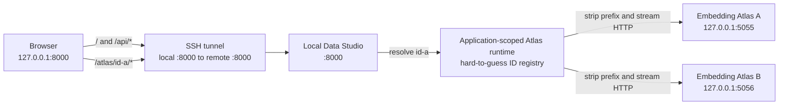

[Back to README.md](../README.md)

# Developer Implementation Notes

This document explains the roles of the main Local Data Studio source files and the important design constraints that must be preserved when changing the implementation.

For regular usage instructions, see [README.md](../README.md).
This document is intended for developers who want to understand the code structure or add, modify, and maintain features.

This document introduces some technical terms that may be unfamiliar.
Terms are explained when they first appear whenever practical, but you do not need to memorize everything before you begin.
Focus on the sections related to the feature you are changing and the constraints described there.

## Overall Project Structure

The main application package is located under `src/local_data_studio`.
Static files used by the browser, such as JavaScript and CSS files, are stored under `src/local_data_studio/static` and are included in the Python package.
Together, these files form the user interface (UI), which is the part of the application that users see and operate.

The `local_data_studio.toml` file in the workspace is the standard file for application settings.
Here, a workspace means the working directory that contains data, caches, local models, configuration files, and related resources.

The `local_data_studio.toml` file mainly configures the following items:

* Paths for data, caches, and related files
* Server settings
* EDA (exploratory data analysis) settings
* Embedding Atlas settings
* Whether rows may be deleted from source data files
* LLM (large language model) profiles used for SQL generation and translation

When starting the application from the command line, use `--config` to select the configuration file explicitly.
A mechanism for operating software from the command line is called a CLI (command-line interface).

The `.env` file is loaded relative to the selected workspace.
It is intended mainly for credentials such as API keys and optional overrides that should apply only to the current computer.

At runtime, `data`, `cache`, and `models/embedder` are resolved relative to the selected workspace or the current working directory.
The current working directory is the directory that is active when the command is run.

When the same setting is defined in more than one place, the following precedence order applies:

1. Command-line options
2. Operating system environment variables
3. `local_data_studio.toml`
4. `.env`
5. Workspace-based defaults
6. Current-working-directory-based defaults

## Application Entry Point and API

An API (application programming interface) is an interface through which another program, such as the browser, can call application features.

`src/local_data_studio/app.py` is a small entry point that assembles the Local Data Studio application.
An entry point is the code first used when an application starts.
Rather than implementing individual features directly, this file connects the API, static files, background processing, and other components to the application.

Request models, which describe the data accepted by the API, and API routes, which define how each URL is handled, are located under `src/local_data_studio/server/api`.
They are divided mainly into the following responsibilities:

* Dataset access
* Analysis
* Background jobs
* Data modification
* The Atlas reverse proxy
* Shared services
* Static-file mounting, which registers files so that they can be served from specific URLs

Operations involving the filesystem, DuckDB, EDA, and similar work may occupy the current thread while waiting to finish.
These operations run in FastAPI's thread pool.
A thread pool reuses a set of worker threads to execute tasks.

Streaming file uploads and Atlas proxy traffic are handled asynchronously.
Asynchronous processing makes it easier to handle other requests while waiting for network communication, so one connection is less likely to block other connections.

The application `lifespan` manages resources shared from startup through shutdown.
Here, `lifespan` means the group of operations performed when the application starts and stops.

The managed resources include the following:

* `JobStore`
* The Atlas runtime
* The HTTP client used by the proxy
* The shutdown order for Atlas child processes

## Browser-Side UI

The UI is the part of the application that users see and operate in the browser, including buttons, input fields, and tables.

`/app.js` remains the stable entry point for browser-side code.
The actual implementation is divided into dependency-ordered ES modules under `static/app`.

ES modules provide a way to divide JavaScript into files with separate responsibilities and import required functionality between those files.
The implementation separates the following responsibilities:

* Application state and references to DOM elements that represent items on the page
* Display formatting
* HTTP communication
* Image handling
* LLM selection
* Translation controls and results stored in browser memory
* Custom dropdown presentation that remains compatible with native `select` elements
* Atlas operations
* Overall application orchestration

Native `select` elements remain the source of truth for selected values and `change` events.
On top of them, `static/app/selects.js` provides a scrollable presentation showing approximately six options and supports keyboard interaction.
The lower gradient is derived from the current scroll position and disappears when the last option is reached.

On desktop, the dataset list, preview, and inspector are arranged as three panes within the browser viewport.
Each pane scrolls only within its own region.

The main toolbar uses two compact rows on desktop.
Translation selectors occupy the first row, data search is anchored to the lower
left, and row and page controls are anchored to the lower right.
At narrower widths, these groups wrap or stack without allowing native `select`
elements to exceed the viewport.

At the mobile and tablet breakpoint, the document returns to normal vertical scrolling.
The CSS Grid order becomes the dataset sidebar, the main workspace, and then the inspector.
This keeps the dataset selector directly below the title bar.

Icon actions use packaged SVG assets and expose their action names through `aria-label` attributes and tooltips.
An `aria-label` provides an action name to assistive technology such as screen readers.

The logo and title in the top bar form one external link that opens the repository in a separate tab.
The link uses `noopener noreferrer` so that the opened page cannot unnecessarily control the original page.

Structured values such as lists and objects use the same JSON syntax coloring in expanded Preview fields, the Row Inspector, and the code-view dialog.

`styles.css` is kept as a single file so that the order of CSS rules remains stable.
All JavaScript modules and CSS files are included in the wheel, which is the distribution format used for the Python package.

## Dataset Reading

`src/local_data_studio/server/readers.py` remains as a compatibility entry point for existing code.
Format-specific implementations are separated under `src/local_data_studio/server/dataset_readers`.

Readers for line-oriented formats are further divided into the following responsibilities:

* Cursor-based page navigation
* JSONL reading
* Delimited-format reading for CSV, TSV, and related formats
* Sparse line-index management

`dataset_readers/line.py` serves as the compatibility entry point for these components.
A sparse line index records positions only at selected intervals instead of storing the location of every row.
This reduces storage compared with a complete index while still allowing the reader to move efficiently near a target position.

### JSONL, CSV, and TSV

JSONL metadata inference stops when it reaches a predefined row or byte limit.
Metadata inference reads part of the data to estimate information such as column names and value types.
Even when the file contains a single extremely long physical line, schema inference does not read beyond the remaining byte budget.

JSONL, CSV, and TSV previews use fingerprinted sparse line indexes together with byte positions or page tokens.
A fingerprint is identifying information used to determine whether the same file is still in the same state.

Completed indexes are reused.
Checkpoints created while building an index are stored in transactions that group multiple updates into one operation.

CSV and TSV schema inference, preview, search, and Raw display use a shared parser that supports long fields.
A parser reads text from a file and converts it into values the application can use.

### Parquet

Parquet schemas are read from metadata stored in the footer at the end of the file without scanning the entire file contents.

Preview and Raw display use record batches, which group a limited number of rows, to control how much data is loaded at once.
Offset-compatibility handling also uses row-group metadata instead of scanning one row at a time from the beginning of the file.

## Column Statistics

`src/local_data_studio/server/stats.py` remains as a compatibility entry point for existing code.
The actual implementation is divided under `src/local_data_studio/server/column_stats`.

The package separates the following responsibilities:

* Value-type inference
* Per-column aggregation
* Overall DuckDB orchestration

Sample rows are retrieved in fixed-size batches and passed directly to per-column accumulators.
This avoids holding both a complete row matrix and separate column copies in memory at the same time.

## SQL Execution

SQL execution is centralized in `src/local_data_studio/server/sql.py`.

This module is responsible mainly for the following operations:

* Validating that SQL is read-only
* Applying DuckDB resource limits such as timeouts and memory limits
* Supporting cooperative cancellation for background jobs

Cooperative cancellation means that a process is not forcibly terminated externally at an arbitrary point.
Instead, the process checks for a cancellation request at safe boundaries and exits cleanly.

## LLM Text Generation

SQL generation and manual translation share an adapter that lazily loads the LiteLLM Python SDK.
Lazy loading means that a library is not imported until the feature is actually needed.
This avoids unnecessary imports when the application starts without using LLM features.

The related modules have the following responsibilities:

* `server/llm_profiles.py`

  * Validates server-managed LLM model profiles.
  * Checks whether each profile may be used for SQL generation and translation.
* `server/llm_prompt.py`

  * Builds one provider-independent user message.
  * Validates SQL generated by the LLM.
* `server/llm_client.py`

  * Sends the shared text-generation request.
* `server/llm_service.py`

  * Selects the profile to use.
  * Orchestrates the overall SQL-generation process.

Provider error bodies and credentials are not included in API responses.

### Manual Translation

Translation is submitted through the same cancellable `JobStore` contract used by other long-running operations.
It accepts only JSON values that are already loaded in the browser's current Preview page.
The server does not load source rows or Raw values separately for translation.

The translation modules have the following responsibilities:

* `server/translation_config.py`

  * Owns the fixed target-language registry.
  * Manages the optional initial target language selected through TOML.
  * Validates translation request limits.
* `server/translation_values.py`

  * Copies nested JSON values.
  * Identifies natural-language strings only.
  * Restores translated text into the original structure without changing keys or non-string values.
* `server/translation_service.py`

  * Resolves translation-enabled profiles.
  * Recalculates request limits on the server.
  * Splits requests into chunks.
  * Validates that ID mappings match exactly.
  * Retries malformed output once.
  * Reports progress.

Source and translated text are not persisted on the server.
The number of concurrent LiteLLM calls is limited across the process by a bounded semaphore, which caps concurrent execution.
Cancellation is checked between chunks and before retries.

The service does not depend on provider-specific structured-output features.
Normal assistant text is parsed as strict JSON and must match the requested IDs exactly in a one-to-one mapping.

`static/app/translation.js` is responsible for the following operations:

* Selecting the model and target language
* Showing a confirmation dialog before sending a large request
* Monitoring job state
* Cooperatively cancelling a superseded job when another translation starts or
  when its model or target language changes
* Managing the translation cache stored only in browser memory

The toolbar intentionally does not expose a persistent translation progress label
or Cancel button.
Provider and validation failures are shown through the shared error dialog.

The translation cache key includes the following information:

* The dataset view
* Page or query conditions
* Row and column identity
* The source-text fingerprint
* The model
* The target language

Only the selected model and target language are stored in `localStorage`.
Source and translated text are not stored there.

When `[translation].default_target_language` is specified, it has the highest priority for the initial selection when the browser opens.
Otherwise, the target language is selected in the following order:

1. The selection saved in the browser
2. An exact match with the browser locale
3. A match with the base language of the browser locale
4. The server default, `ja`
5. The first language in the registered language list

The browser and server apply the same conservative classification to numeric-only structures, Boolean values, binary objects, and data recognized as images or audio.
This classification hides translation controls for unsuitable values and causes the server to reject corresponding requests.

Expanded fields and the JSON code view use the same translation cache.
This allows both views to display the same result without sending another request to the provider.

The action area in the JSON code view reserves space at the top and right.
The Copy icon uses the same bordered background surface as the adjacent translation action.
This keeps the controls separate from the header and aligns icon and text actions even in information-dense overlays.
The original and translated JSON bodies share one flex-based vertical scroll
container, which prevents the translated section from being clipped on mobile.
Copy actions in this dialog reuse the same `is-copied` green feedback state as
copy actions elsewhere in the interface.

## EDA Reports

Overall EDA report orchestration is handled by `src/local_data_studio/server/eda_reports.py`.
Profiling configuration and the conversion of a DataFrame into a form that can be analyzed safely are separated into `src/local_data_studio/server/eda.py`.
A DataFrame is a Python structure for working with tabular data made up of rows and columns.

For EDA requests without session-hidden rows, `load_eda_dataframe()` applies `EDA_ROW_LIMIT` directly to the source before creating a pandas DataFrame.
When hidden rows are present, the existing DuckDB relation containing row IDs is used so that exclusions remain correct.
A relation is a DuckDB object that represents tabular data processing.

Generated reports are stored under `./cache/eda`.
When the cache exceeds its size limit, shared capacity-management logic removes the oldest files first.

## Embedding Atlas

`src/local_data_studio/server/atlas.py` remains as a compatibility entry point for existing code.
The actual implementation is divided by responsibility under `src/local_data_studio/server/atlas_components`.

The main components include the following:

* Input and output formats and transfer contracts
* Embedding adapters that select behavior according to model capabilities
* Safe prompt templates
* Image-value resolution
* Dimensionality-reduction inputs that delay loading until needed
* Display DataFrame construction
* Dimensionality reduction
* Dataset caching
* Atlas command construction
* Atlas readiness checks
* Port allocation that is safe for browser access
* Subprocess control
* Overall Atlas orchestration

`server/embedder_capabilities.py` inspects only local model metadata without loading model weights.
The amount of data inspected is bounded.
It also creates identifying values from configuration information related to model compatibility so that the application can determine whether a cache entry may be reused.

### Sampling and Memory Usage

When `ATLAS_SAMPLE` is positive, SQL filtering and deterministic row limiting are performed in DuckDB before creating a pandas DataFrame.

An encoder is created only once per Atlas job and is reused across multiple batches.

Text prompts are expanded only for the batch currently being processed.
Images are stored in a temporary disk area that is removed automatically after processing, and only the data required for the current batch is loaded into memory.

When dimensionality reduction runs in `full` mode, embedding batches are written directly into the final array instead of being retained in a list for later concatenation.
However, UMAP in `full` mode, t-SNE, and PCA still require the complete sampled embedding matrix.

In `anchor_transform` mode, only the embeddings for the data used as layout anchors and the current transform batch are retained.

Display-value sanitization and coordinate attachment preserve the original image representation, including URLs, paths, and `{bytes, path}` values.

When identical inputs cause concurrent cache misses, the requests share one cancellable cache-generation operation instead of generating the cache multiple times.

### UMAP Reproducibility

Atlas uses a fixed random seed for UMAP dimensionality reduction so that the same conditions are more likely to produce the same cached result.

It also sets `n_jobs=1` explicitly to match UMAP's seeded execution mode.
This prevents warnings that UMAP has overridden the configured thread count.

### Subprocess Startup on macOS

On macOS, Atlas subprocess startup is constrained to use Python's `posix_spawn` path.
This avoids `SIGSEGV (-11)` that can occur when `fork`, which creates a child process by duplicating the parent process, is used on the child side.

> [!IMPORTANT]
> The following conditions are implementation requirements for stable Atlas startup on macOS.
> Do not change them without first confirming why they are required.

* Use an absolute path for the Atlas command
* Do not pass `cwd` to `Popen`
* Keep `close_fds=False`

### Port Selection and Readiness Checks

The Atlas port is selected immediately before starting the subprocess.

`atlas_components/ports.py` excludes the following ports from consideration:

* Ports that Chromium blocks for security reasons
* Ports that are already in use by another process

The Atlas child process is started on `127.0.0.1` with `--no-auto-port`.

The background-job thread owns a synchronous HTTPX client used for readiness checks.
This client does not use proxy settings from operating system environment variables.
It checks both the Atlas page and the metadata endpoint.

Only after both endpoints are ready does the application-scoped Atlas runtime register the child process and return `/atlas/{instance_id}/`.

### Atlas Reverse Proxy

`server/api/atlas_proxy.py` forwards HTTP traffic to registered Atlas instances through the same origin as Local Data Studio.
This kind of mechanism, which forwards user traffic to an internal service, is called a reverse proxy.

The target URL is reconstructed from the ASGI `raw_path` and `query_string`.
Proxy-specific hop-by-hop headers and credentials are not forwarded.
The HTTP `Range` header and transferable response headers are preserved.

The proxy does not buffer an entire Parquet response in memory.
Instead, it streams the raw bytes returned by `aiter_raw()` in the order they arrive.

The asynchronous HTTPX client owned by the application `lifespan` has the following constraints:

* Use `trust_env=False` so that proxy settings from environment variables are ignored
* Do not follow redirects automatically
* Do not use the client from a background-job thread

The synchronous client used for readiness checks and the asynchronous client used by the proxy have different purposes and owners.
Do not confuse or interchange them.

### Atlas Runtime

`atlas_components/runtime.py` limits the number of pending and running Atlas child processes with `ATLAS_MAX_INSTANCES`.

It calls `Popen.poll()` on the exact `Popen` object retained at registration time to determine whether that process is still running.
A registration is removed only after the corresponding same `Popen` object has exited.
This prevents a different process from being treated as the same Atlas instance by mistake.

A hard-to-guess instance ID prevents users from selecting an arbitrary internal port.
However, the ID is not an application authentication mechanism.

After application shutdown begins, the runtime rejects new child-process launches and registrations.

## Background Jobs

Background jobs are managed in `src/local_data_studio/server/jobs.py`.

`JobStore` manages job state, progress, results, errors, and cancellation requests.
The worker threads that execute background tasks are managed by an executor.

The `JobStore` owned by each application shuts down in the following order when the `lifespan` ends:

1. Stop accepting new jobs
2. Request cooperative cancellation of running work
3. Shut down the executor

At most 256 completed, failed, or cancelled job records are retained.
Queued and running jobs are never removed because of this history limit.

The API returns immutable snapshots captured while holding the relevant lock.
A snapshot is a copy of the state at the time it was captured.
The API does not expose internal live records whose contents may change while work is in progress.

Progress, cancellation, results, and error states are available through `/api/jobs/*`.

## Cache Capacity Management and Safe Writes

Cache pruning scans each file only once while holding a directory-specific lock.
A lock prevents multiple operations from changing the same data concurrently and interfering with one another.

When multiple files have the same modification time, deletion order is determined by path.
This makes the deletion order deterministic under identical conditions.

JSON caches are replaced safely using the following steps:

1. Write the data to a temporary file
2. Call `flush()` to pass buffered data to the storage layer
3. Replace the existing file atomically with `os.replace()`

This approach prevents an interrupted write from replacing a valid cache with an incomplete file.

## Docstring Policy

Public Python APIs use docstrings that follow PEP 257 and Google style.
A docstring is a string in source code that explains the purpose and usage of a function, class, or similar object.

There is no need to repeat information that is already clear from types and names.
Document details that are not obvious from those elements, including the following:

* Constraints
* Possible exceptions
* Side effects
* Cancellation behavior
* Thread safety
* Resource ownership

Private helper functions are documented only when an algorithmic, compatibility, or security requirement would otherwise be easy to break.
Do not add docstrings that merely restate behavior that is already obvious from the code.

## Release Automation

`.github/workflows/release-please.yml` runs after changes reach `main` and uses
Release Please's Python release strategy to create or update one Release PR.
`release-please-config.json` defines the package and tag format, while
`.release-please-manifest.json` records the last released version.
The Release PR updates `pyproject.toml` and `CHANGELOG.md` together.

Merging the Release PR causes Release Please to create a `v<version>` tag and a
published GitHub Release.
`.github/workflows/publish.yml` responds to that published Release, verifies that
the tag matches the package version, builds the distributions, and waits for the
protected `pypi` Environment before publishing through Trusted Publishing.
Its manual `workflow_dispatch` path publishes the selected branch to TestPyPI
instead.

The release workflow receives its GitHub token from the
`RELEASE_PLEASE_TOKEN` repository secret; the token value is not stored in the
repository.

## Atlas Port and Proxy Flow



An SSH tunnel is not required when Local Data Studio and the browser run on the same computer.
Whether Local Data Studio is used locally or on a remote server, Atlas child-process ports remain internal.

Local Data Studio does not enable Embedding Atlas MCP or WebSocket mode.
Therefore, the current reverse proxy handles HTTP traffic only.

The mapping between Atlas instance IDs and child processes is stored in memory inside the application process.
This mapping is not shared between multiple Uvicorn workers.
A Uvicorn worker is an independent process that handles HTTP requests.

> [!IMPORTANT]
> Start Local Data Studio with one worker when using Uvicorn.

## Starting Directly with Uvicorn

During development, you can start the application directly with Uvicorn.

Uvicorn is an ASGI server.
ASGI is a common interface that connects Python web servers and web applications.

Here, the ASGI application is the Local Data Studio application object specified as `local_data_studio.app:app`.
You do not need to be familiar with this term for regular use.

When starting the application directly, set `LOCAL_DATA_STUDIO_CONFIG_FILE` in the shell so that the same project configuration is used.

```bash
LOCAL_DATA_STUDIO_CONFIG_FILE=./local_data_studio.toml \
  uv run uvicorn local_data_studio.app:app --reload
```

The trailing `\` means that the same command continues on the next line.
The two lines above form one command and are equivalent to the following one-line command:

```bash
LOCAL_DATA_STUDIO_CONFIG_FILE=./local_data_studio.toml uv run uvicorn local_data_studio.app:app --reload
```
