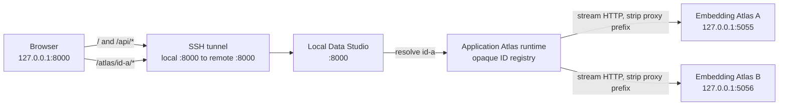

[Back to README.md](../README.md)

# Developer Implementation Notes

This section describes the roles of the main source files and modules.

- The application package is located under `src/local_data_studio`. Static UI files are stored in `src/local_data_studio/static` and included in the Python package. A workspace's `local_data_studio.toml` is the usual configuration source for paths, server values, EDA, Atlas, deletion controls, and LLM profiles; the CLI selects it explicitly with `--config`. `.env` is loaded from the configured workspace only for credentials and optional machine-local overrides. At runtime, `.env`, `data`, `cache`, and `models/embedder` are resolved relative to the selected workspace or current working directory. Configuration precedence is: command-line options, operating system environment variables, configuration file, `.env`, workspace defaults, and current-working-directory defaults.
- `src/local_data_studio/app.py` is a small entry point that assembles the application. Request models and API routes are located under `src/local_data_studio/server/api` and are separated into dataset access, analysis, background jobs, data mutation, the Atlas reverse proxy, shared services, and static-file mounting. Blocking filesystem, DuckDB, EDA, and job operations run in FastAPI's thread pool, while streaming uploads and Atlas proxy traffic remain asynchronous. The application lifespan owns its JobStore, Atlas runtime, proxy HTTP client, and child-process shutdown order.
- `src/local_data_studio/server/readers.py` remains as a compatibility facade, while format-specific implementations are separated under `src/local_data_studio/server/dataset_readers`. JSONL metadata inference stops after fixed row and byte limits. JSONL, CSV, and TSV previews use fingerprinted sparse line indexes together with byte positions or page tokens. Completed indexes are reused, and checkpoints are stored in batch transactions. CSV and TSV schema inference, preview, search, and Raw display share a parser that supports long fields. Parquet schemas are read only from footer metadata. Preview and Raw display use bounded record batches, and offset compatibility uses row-group metadata instead of scanning row by row.
- `src/local_data_studio/server/stats.py` remains as a compatibility facade, while value-type inference, per-column aggregation, and DuckDB orchestration are separated under `src/local_data_studio/server/column_stats`. Sample rows are retrieved in fixed-size batches and passed directly to per-column accumulators without simultaneously retaining a full row matrix and separate column copies.
- SQL execution is centralized in `src/local_data_studio/server/sql.py`. It handles read-only SQL validation, DuckDB resource limits, and cooperative cancellation of background jobs.
- SQL generation uses the LiteLLM Python SDK through a lazily loaded adapter. `server/llm_profiles.py` validates server-managed model profiles, while `server/llm_prompt.py` builds a single provider-independent user message and validates generated SQL. `server/llm_client.py` handles the shared completion request, and `server/llm_service.py` manages profile selection and overall orchestration. Provider error bodies and credentials are not included in API responses.
- EDA report orchestration is separated into `src/local_data_studio/server/eda_reports.py`, while profiling configuration and safe DataFrame sanitization are handled in `src/local_data_studio/server/eda.py`. Reports are isolated under `./cache/eda` and use shared size-based eviction that removes the oldest files first.
- `src/local_data_studio/server/atlas.py` remains as a compatibility facade. Components for input and output contracts, capability-driven embedding adapters, safe prompt templates, image conversion, dimensionality reduction, dataset caching, browser-safe port allocation, subprocess control, and overall orchestration are separated under `src/local_data_studio/server/atlas_components`. `server/embedder_capabilities.py` performs bounded metadata-only model inspection and creates cache-identifying values from configuration information related to model compatibility. An encoder is created only once per Atlas job and reused across anchor and transform batches. Full and anchor embedding work is split into bounded batches with progress and cancellation checks between them. In `anchor_transform` mode, the complete input column is not converted into a Python list; only the anchor data and current transform batch are retrieved. Display-value sanitization and addition of two-dimensional coordinate columns are performed on a single dedicated DataFrame copy. Concurrent cache misses for the same dataset, query, column, model, backend, prompt, and settings share one cache-generation operation, and waiting for that lock remains cancellable.
- Atlas UMAP dimensionality reduction uses a fixed random seed so that cache artifacts are reproducible. It also explicitly sets `n_jobs=1` to match UMAP's seeded execution mode and avoid warnings about overriding the thread count.
- On macOS, Atlas subprocess startup is constrained to use Python's `posix_spawn` path to avoid `SIGSEGV (-11)` caused by child-side `fork`. Keep the Atlas command as an absolute path, do not pass `cwd` to `Popen`, and preserve `close_fds=False`.
- Atlas ports are selected immediately before subprocess startup. `atlas_components/ports.py` skips Chromium-restricted and currently occupied ports, and the child is launched with `--no-auto-port` on `127.0.0.1`. A synchronous HTTPX client owned by the job thread checks both the page and metadata endpoint with environment proxies disabled. Only then does the application-scoped runtime register the child and return `/atlas/{instance_id}/`.
- `server/api/atlas_proxy.py` forwards registered Atlas HTTP traffic through the Local Data Studio origin. It reconstructs targets from ASGI `raw_path` and `query_string`, filters hop-by-hop and private headers, preserves Range and end-to-end response metadata, and streams `aiter_raw()` bytes without buffering a complete Parquet response. Its lifespan-owned asynchronous HTTPX client uses `trust_env=False`, does not follow redirects, and is never used by a background job thread.
- `atlas_components/runtime.py` bounds pending and live children with `ATLAS_MAX_INSTANCES`, uses `Popen.poll()` for process identity and liveness, and removes registrations when their exact process exits. Opaque IDs prevent arbitrary port selection but do not provide application authentication. The runtime rejects spawn and registration once shutdown starts.
- Background jobs are managed in `src/local_data_studio/server/jobs.py`. Each application owns a store whose executor stops accepting work, requests cooperative cancellation, and shuts down during lifespan cleanup. Progress, cancellation, results, and error states are available through `/api/jobs/*`.

## Atlas Port And Proxy Flow



The SSH tunnel is optional for same-machine use. Atlas child ports remain internal in both cases. The reverse proxy currently supports HTTP only because Local Data Studio does not enable Embedding Atlas MCP/WebSocket mode. Run Uvicorn with one worker; the in-memory registry is intentionally application-process local.

During development, you can start the application directly with Uvicorn.
Uvicorn is an ASGI server, and ASGI is a standard interface between Python web servers and web applications.
In this context, the ASGI application is the Local Data Studio application object referenced by `local_data_studio.app:app`.
You do not need to understand this terminology for normal use.

To use the same project configuration during direct Uvicorn startup, set `LOCAL_DATA_STUDIO_CONFIG_FILE` in the shell before starting it:

```bash
LOCAL_DATA_STUDIO_CONFIG_FILE=./local_data_studio.toml \
  uv run uvicorn local_data_studio.app:app --reload
```
