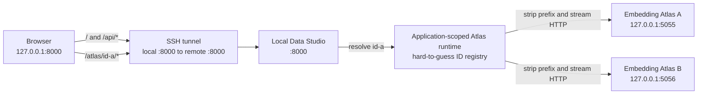

[Back to README.md](../README.md)

# Developer Implementation Notes

This document explains the roles of the main Local Data Studio source files and the important design constraints that should be preserved when modifying the implementation.

For regular usage instructions, see [README.md](../README.md).
This document is intended for developers who want to read the code or add, modify, or maintain features.

## Overall Project Structure

The main application package is located under `src/local_data_studio`.
Static UI files used by the browser, such as JavaScript and CSS files, are stored under `src/local_data_studio/static` and are included in the Python package.

The `local_data_studio.toml` file in the workspace is the standard configuration file for the following settings:

* Paths for data, caches, and related files
* Server settings
* EDA settings
* Embedding Atlas settings
* Permission to delete rows from source data files
* LLM profiles used for SQL generation and translation

When starting the application from the CLI, use `--config` to select the configuration file explicitly.

The `.env` file is loaded relative to the selected workspace.
It is intended mainly for credentials such as API keys and optional overrides that should apply only to the current computer.

At runtime, `data`, `cache`, and `models/embedder` are resolved relative to the selected workspace or the current working directory.

When the same setting is defined in more than one place, the following precedence order applies:

1. Command-line options
2. Operating system environment variables
3. `local_data_studio.toml`
4. `.env`
5. Workspace-based defaults
6. Current-working-directory-based defaults

## Application Entry Point and API

`src/local_data_studio/app.py` is a small entry point that assembles the Local Data Studio application.
Instead of implementing individual features directly, it connects the API, static files, background processing, and other application components.

Request models and API routes are located under `src/local_data_studio/server/api` and are divided mainly into the following responsibilities:

* Dataset access
* Analysis
* Background jobs
* Data modification
* The Atlas reverse proxy
* Shared services
* Static-file mounting

Operations involving the filesystem, DuckDB, EDA, and other work that may block a thread are executed in FastAPI's thread pool.
Streaming file uploads and Atlas proxy traffic are handled asynchronously so that they are less likely to block other connections.

The application lifespan manages the following resources that are shared from application startup through shutdown.
Here, the lifespan means the group of operations performed when the application starts and stops.

* `JobStore`
* The Atlas runtime
* The HTTP client used by the proxy
* The shutdown order for Atlas child processes

## Browser-Side UI

`/app.js` remains the stable entry point for browser-side code.
The actual implementation is divided into dependency-ordered ES modules under `static/app`.

ES modules provide a way to divide JavaScript into files with separate responsibilities and import the required functionality between them.
The implementation separates the following responsibilities:

* Application state and references to DOM elements
* Display formatting
* HTTP communication
* Image handling
* LLM selection
* Translation controls and browser-memory results
* Native-select-compatible custom dropdown presentation
* Atlas operations
* Overall application orchestration

Native `select` elements remain the source of truth while `static/app/selects.js` provides the scrollable six-row presentation and keyboard interaction.
Its overflow indicator is derived from the current scroll position, so the lower fade is removed at the last option.

Desktop layouts use a viewport-bound three-pane shell with internal scrolling in the dataset, Preview, and inspector regions.
At the mobile/tablet breakpoint the document returns to normal vertical scrolling and orders the grid as dataset sidebar, main workspace, then inspector, so the dataset chooser remains directly below the title bar.
Icon actions use packaged SVG assets and retain explicit labels through `aria-label` and tooltips.

`styles.css` is kept as a single asset so that the order of CSS rules remains stable.
All JavaScript modules and CSS files are included in the distributed wheel.

## Dataset Reading

`src/local_data_studio/server/readers.py` remains as a compatibility entry point for existing code.
Format-specific implementations are separated under `src/local_data_studio/server/dataset_readers`.

Readers for line-oriented formats are further divided into the following responsibilities:

* Cursor-based page navigation
* JSONL reading
* Delimited-format reading for CSV, TSV, and related formats
* Sparse line-index management

`dataset_readers/line.py` serves as the compatibility entry point for these components.
A sparse line index records positions only at selected intervals rather than storing the location of every row, allowing the reader to move efficiently to a nearby position.

### JSONL, CSV, and TSV

JSONL metadata inference stops when it reaches a predefined row or byte limit.
Even when the file contains a single extremely long physical line, the reader does not consume more than the remaining byte budget for schema inference.

JSONL, CSV, and TSV previews use fingerprinted sparse line indexes together with byte positions or page tokens.
A fingerprint is identifying information used to determine whether a file is still in the same state.

Completed indexes are reused.
Checkpoints created while building an index are stored in batched transactions.

CSV and TSV schema inference, preview, search, and Raw display use a shared parser that supports long fields.

### Parquet

Parquet schemas are read from metadata stored in the file footer without scanning the entire file contents.

Preview and Raw display use bounded record batches to limit how much data is loaded at once.
Offset-compatibility handling also uses row-group metadata instead of scanning one row at a time from the beginning of the file.

## Column Statistics

`src/local_data_studio/server/stats.py` remains as a compatibility entry point for existing code.
The actual implementation is divided under `src/local_data_studio/server/column_stats`.

The package separates the following responsibilities:

* Value-type inference
* Per-column aggregation
* Overall DuckDB orchestration

Sample rows are retrieved in fixed-size batches and passed directly to per-column accumulators.
This avoids holding both a complete row matrix and separate column copies in memory at the same time.

## SQL Execution

SQL execution is centralized in `src/local_data_studio/server/sql.py`.

This module is responsible mainly for the following operations:

* Validating that SQL is read-only
* Applying DuckDB resource limits such as timeouts and memory limits
* Supporting cooperative cancellation for background jobs

Cooperative cancellation means that a process is not terminated externally at an arbitrary point.
Instead, the process checks for a cancellation request at safe boundaries and exits cleanly.

## LLM Text Generation

SQL generation and manual translation share an adapter that lazily loads the LiteLLM Python SDK.
Lazy loading means that a library is not imported until the feature is actually needed.

The related modules have the following responsibilities:

* `server/llm_profiles.py`

  * Validates server-managed LLM model profiles and their SQL/translation capabilities.
* `server/llm_prompt.py`

  * Builds one provider-independent user message.
  * Validates SQL generated by the LLM.
* `server/llm_client.py`

  * Sends the shared completion request.
* `server/llm_service.py`

  * Selects the profile and orchestrates the overall SQL-generation process.

Provider error bodies and credentials are not included in API responses.

### Manual Translation

Translation is submitted through the same cancellable `JobStore` contract used by other long-running operations.
It accepts only JSON values already loaded in the browser's current Preview page; the server does not load source rows or Raw values for translation.

The translation modules have the following responsibilities:

* `server/translation_config.py`

  * Owns the fixed target-language registry and validated TOML limits.
* `server/translation_values.py`

  * Copies nested JSON values, identifies natural-language string leaves, and restores translated text without changing keys or non-string values.
* `server/translation_service.py`

  * Resolves translation-enabled profiles, enforces server-calculated limits, chunks requests, validates exact ID mappings, retries malformed output once, and reports progress.

The service does not persist source or translated text.
LiteLLM calls are limited by a process-wide bounded semaphore, and cancellation is checked between chunks and retries.
Provider-specific structured-output features are not required; normal assistant text is parsed as strict JSON with an exact one-to-one ID contract.

`static/app/translation.js` owns target/model selectors, confirmation, job polling, and the memory-only browser cache.
Its cache key includes the dataset view, page or query context, row and column identity, source fingerprint, model, and target language.
Only model and language selections are stored in `localStorage`; translation contents are not persisted.
The browser and server apply the same conservative classification to numeric-only structures, booleans, binary objects, and recognized image or audio data before exposing or accepting translation work.
The expanded-field and JSON code views share the same translation cache, so both views render the same result without another provider request. Their copy and translation actions use a shared action-row geometry with a reserved right inset, keeping icon and text controls aligned in dense overlays.

## EDA Reports

Overall EDA report orchestration is handled by `src/local_data_studio/server/eda_reports.py`.
Profiling configuration and the conversion of DataFrames into a safe form for analysis are separated into `src/local_data_studio/server/eda.py`.

Generated reports are stored under `./cache/eda`.
When the cache exceeds its size limit, shared capacity-management logic removes the oldest files first.

## Embedding Atlas

`src/local_data_studio/server/atlas.py` remains as a compatibility entry point for existing code.
The actual implementation is divided by responsibility under `src/local_data_studio/server/atlas_components`.

The main components include the following:

* Input and output data contracts
* Embedding adapters that select behavior according to model capabilities
* Safe prompt templates
* Image-value resolution
* Dimensionality-reduction inputs that delay loading until needed
* Display DataFrame construction
* Dimensionality reduction
* Dataset caching
* Atlas command construction
* Atlas readiness checks
* Port allocation that is safe for browser access
* Subprocess control
* Overall Atlas orchestration

`server/embedder_capabilities.py` performs bounded inspection of local model metadata without loading model weights.
It also creates cache-identifying values from configuration information related to model compatibility.

### Sampling and Memory Usage

When `ATLAS_SAMPLE` is positive, SQL filtering and deterministic row limiting are performed in DuckDB before creating a pandas DataFrame.

An encoder is created only once per Atlas job and is reused across multiple batches.

Text prompts are expanded only for the batch currently being processed.
Images are stored in an automatically cleaned temporary area on disk, and only the data required for the current batch is loaded.

When dimensionality reduction runs in `full` mode, embedding batches are written directly into the final array instead of being retained in a list for later concatenation.
However, UMAP in `full` mode, t-SNE, and PCA still require the complete sampled embedding matrix.

In `anchor_transform` mode, only the anchor embeddings and the current transform batch are retained.

Display-value sanitization and coordinate attachment preserve the original image representation, including URLs, paths, and `{bytes, path}` values.

When identical inputs cause concurrent cache misses, the requests share one cancellable cache-generation operation.

### UMAP Reproducibility

Atlas uses a fixed random seed for UMAP dimensionality reduction so that the same conditions are more likely to produce the same cached result.

It also sets `n_jobs=1` explicitly to match UMAP's seeded execution mode.
This prevents warnings that UMAP has overridden the configured thread count.

### Subprocess Startup on macOS

On macOS, Atlas subprocess startup is constrained to use Python's `posix_spawn` path to avoid `SIGSEGV (-11)` caused by child-side `fork`.

To preserve this behavior, do not change the following implementation requirements:

* Use an absolute path for the Atlas command
* Do not pass `cwd` to `Popen`
* Keep `close_fds=False`

### Port Selection and Readiness Checks

The Atlas port is selected immediately before starting the subprocess.

`atlas_components/ports.py` excludes the following ports from consideration:

* Ports that Chromium blocks for security reasons
* Ports that are already in use by another process

The Atlas child process is started on `127.0.0.1` with `--no-auto-port`.

A synchronous HTTPX client owned by the background-job thread does not use proxy settings from operating system environment variables.
This client checks both the Atlas page and the metadata endpoint.

Only after both endpoints are ready does the application-scoped Atlas runtime register the child process and return `/atlas/{instance_id}/`.

### Atlas Reverse Proxy

`server/api/atlas_proxy.py` forwards HTTP traffic to registered Atlas instances through the same origin as Local Data Studio.

The target URL is reconstructed from the ASGI `raw_path` and `query_string`.
Proxy-specific hop-by-hop headers and credentials are not forwarded, while the HTTP `Range` header and transferable response headers are preserved.

The proxy does not buffer an entire Parquet response in memory.
Instead, it streams the raw bytes returned by `aiter_raw()` as they arrive.

The asynchronous HTTPX client owned by the application lifespan has the following constraints:

* Use `trust_env=False` so that proxy settings from environment variables are ignored
* Do not follow redirects automatically
* Do not use the client from a background-job thread

### Atlas Runtime

`atlas_components/runtime.py` limits the number of pending and running Atlas child processes with `ATLAS_MAX_INSTANCES`.

It uses `Popen.poll()` to verify both that the process is still the same registered process and whether it is still running.
A registration is removed only when the corresponding exact `Popen` instance exits.

A hard-to-guess instance ID prevents users from selecting an arbitrary internal port.
However, the ID is not an application authentication mechanism.

After application shutdown begins, the runtime rejects new child-process launches and registrations.

## Background Jobs

Background jobs are managed in `src/local_data_studio/server/jobs.py`.

The `JobStore` owned by each application shuts down in the following order when the lifespan ends:

1. Stop accepting new jobs
2. Request cooperative cancellation of running work
3. Shut down the executor

An executor manages the worker threads that actually run background tasks.

At most 256 completed, failed, or cancelled job records are retained.
Queued and running jobs are never removed because of this history limit.

The API returns immutable snapshots obtained while holding the relevant lock.
It does not expose internal live records whose contents may change while work is in progress.

Progress, cancellation, results, and error states are available through `/api/jobs/*`.

## Cache Capacity Management and Safe Writes

Cache pruning scans each file only once while holding a directory-specific lock.
When multiple files have the same modification time, deletion order is determined by path so that the result is deterministic.

JSON caches are replaced safely using the following steps:

1. Write the data to a temporary file
2. Flush the contents so they are passed to the storage layer
3. Replace the existing file atomically with `os.replace()`

This approach prevents an interrupted write from replacing a valid cache with an incomplete file.

## Docstring Policy

Public Python APIs use docstrings that follow PEP 257 and Google style.
A docstring is a string in the source code that explains the purpose and usage of a function, class, or similar object.

There is no need to repeat information that is already clear from types and names.
Document details that are not obvious from those elements, including the following:

* Constraints
* Possible exceptions
* Side effects
* Cancellation behavior
* Thread safety
* Resource ownership

Private helper functions are documented only when an algorithmic, compatibility, or security requirement would otherwise be easy to break.

## Atlas Port and Proxy Flow



An SSH tunnel is not required when Local Data Studio and the browser run on the same computer.
Whether Local Data Studio is used locally or on a remote server, Atlas child-process ports remain internal.

Local Data Studio does not enable Embedding Atlas MCP or WebSocket mode, so the current reverse proxy supports HTTP only.

The mapping between Atlas instance IDs and child processes is stored in memory inside the application process.
Because this mapping is not shared between multiple Uvicorn workers, start Uvicorn with one worker.

## Starting Directly with Uvicorn

During development, you can start the application directly with Uvicorn.

Uvicorn is an ASGI server.
ASGI is a common interface between Python web servers and web applications.

In this context, the ASGI application is the Local Data Studio application object referenced by `local_data_studio.app:app`.
You do not need to understand this terminology for regular use.

To use the same project configuration when starting the application directly, set `LOCAL_DATA_STUDIO_CONFIG_FILE` in the shell:

```bash
LOCAL_DATA_STUDIO_CONFIG_FILE=./local_data_studio.toml \
  uv run uvicorn local_data_studio.app:app --reload
```
