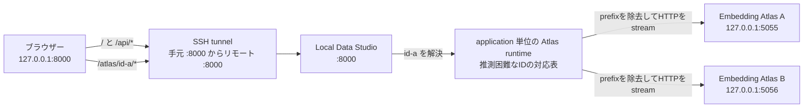

[README_ja.md に戻る](README_ja.md)

# 開発者向けの実装メモ

このセクションでは、主なソースコードの役割を説明します。

- アプリケーション本体は `src/local_data_studio` にあります。静的 UI ファイルは `src/local_data_studio/static` にあり、Python パッケージへ含まれます。ワークスペース内の `local_data_studio.toml` を、パス、サーバー、EDA、Atlas、削除許可、LLM プロファイルの通常の設定場所とし、CLI では `--config` で明示的に選択します。`.env` は、設定済みのワークスペースを基準に、認証情報と任意のマシン固有上書きのためだけに読み込みます。実行時の `data`、`cache`、`models/embedder` は、選択したワークスペースまたは現在の作業ディレクトリを基準にします。設定の優先順位は、コマンドラインオプション、OS の環境変数、設定ファイル、`.env`、ワークスペースのデフォルト、現在の作業ディレクトリのデフォルトの順です。
- `src/local_data_studio/app.py` は、アプリケーション全体を組み立てる小さなエントリーポイントです。リクエストモデルと API ルートは `src/local_data_studio/server/api` にあり、データセットアクセス、分析、バックグラウンドジョブ、データ変更、Atlas リバースプロキシ、共通サービス、静的ファイルのマウントに分割されています。ファイルシステム、DuckDB、EDA、ジョブに関するブロッキング処理は FastAPI のスレッドプールで実行し、ストリーミングアップロードと Atlas のプロキシ通信は非同期処理にします。アプリケーションの lifespan が JobStore、Atlas runtime、プロキシ用 HTTP client、子プロセスの終了順序を所有します。
- `/app.js` はブラウザー向けの安定した入口として維持し、`static/app` の依存方向を整理した ES module を読み込みます。state と DOM 参照、format、HTTP 通信、画像処理、LLM 選択、Atlas、アプリケーション全体の制御を、DOM、表示文言、CSS の値、操作フローを変えずに分離しています。`styles.css` は順序を保った単一 asset のままとし、すべての module を wheel に含めます。
- `src/local_data_studio/server/readers.py` は互換性のための窓口として維持し、形式ごとの実装は `src/local_data_studio/server/dataset_readers` に分割しています。行形式の reader は、さらに cursor、JSONL、区切り形式、疎 index の責務へ分け、`dataset_readers/line.py` を互換窓口とします。JSONL のメタデータ推論は、行数とバイト数の固定上限へ達すると停止し、巨大な物理 1 行でも残りの schema byte budget より多く読みません。JSONL、CSV、TSV のプレビューでは、フィンガープリント付きの疎な行インデックスと、バイト位置またはページトークンを使用します。完成済みのインデックスは再利用し、チェックポイントはバッチ単位のトランザクションで保存します。CSV／TSV のスキーマ、プレビュー、検索、Raw 表示は、長いフィールドに対応する共通パーサーを使用します。Parquet のスキーマはフッターのメタデータだけから読み込みます。プレビューと Raw 表示には読み込み量を制限したレコードバッチを使い、オフセット互換処理には行単位のスキャンではなく行グループのメタデータを使用します。
- `src/local_data_studio/server/stats.py` は互換性のための窓口として維持し、`src/local_data_studio/server/column_stats` で値の型推論、カラム単位の集計、DuckDB の処理制御を分離しています。サンプル行は固定サイズのバッチで取得し、行全体の行列とカラムのコピーを同時に保持せず、カラムごとの集計器へ直接渡します。
- SQL 実行は `src/local_data_studio/server/sql.py` に集約しています。読み取り専用 SQL の検証、DuckDB のリソース制限、バックグラウンドジョブの協調的なキャンセルを扱います。
- SQL 生成には、LiteLLM Python SDK を遅延読み込みするアダプター経由で使用します。`server/llm_profiles.py` はサーバー管理のモデルプロファイルを検証し、`server/llm_prompt.py` はプロバイダー共通の 1 件のユーザーメッセージ作成と生成 SQL の検証を行います。`server/llm_client.py` は共通の補完リクエストを担当し、`server/llm_service.py` はプロファイルの選択と処理全体の制御を担当します。プロバイダーから返されたエラー本文や認証情報は、API レスポンスへ含めません。
- EDA レポート全体の処理制御は `src/local_data_studio/server/eda_reports.py`、プロファイリング設定と DataFrame の安全な整形は `src/local_data_studio/server/eda.py` に分離しています。レポートは `./cache/eda` に分離して保存し、共通の容量管理によって古いファイルから削除します。
- `src/local_data_studio/server/atlas.py` は互換性のための窓口として維持し、`src/local_data_studio/server/atlas_components` に、入出力の取り決め、モデルの対応状況に応じて処理を選ぶ埋め込みアダプター、安全なプロンプトテンプレート、画像値の解決、遅延 projection 入力、表示用 DataFrame、次元削減、データセットキャッシュ、コマンド構築、readiness 確認、ブラウザーから利用できるポートの割り当て、サブプロセス制御、処理全体の制御を分割しています。`server/embedder_capabilities.py` は、読み込み量に上限を設けたメタデータだけのモデル検査と、モデルの対応状況に関わる設定情報からキャッシュ判定用の識別値を作成する処理を担当します。`ATLAS_SAMPLE` が正の場合、SQL の絞り込みと決定的な行数制限を pandas の DataFrame 化より前に DuckDB 内で行います。エンコーダーは Atlas ジョブごとに 1 回だけ生成して各バッチで再利用します。text prompt はバッチ単位で展開し、画像は自動削除される disk-backed spool を使い、full projection の埋め込みバッチは連結用リストへ保持せず最終配列へ直接書き込みます。ただし、full UMAP、t-SNE、PCA は抽出済みの埋め込み行列全体を必要とします。`anchor_transform` は anchor と現在の transform バッチだけを保持します。表示値の整形と座標追加では画像の元形式を維持します。同一入力の並行した cache miss は、キャンセル可能な 1 回の cache 生成を共有します。
- Atlas の UMAP による次元削減では、キャッシュ結果を再現できるように乱数シードを固定します。また、乱数シードを固定した UMAP の実行方式に合わせて `n_jobs=1` を明示し、スレッド数の上書きに関する警告が表示されないようにしています。
- macOS では、子プロセス側の fork による `SIGSEGV (-11)` を避けるため、Atlas のサブプロセス起動が Python の `posix_spawn` 経路を使用する形に固定しています。Atlas コマンドには絶対パスを使用し、`Popen` へ `cwd` を渡さず、`close_fds=False` を維持してください。
- Atlas のポートは、サブプロセス起動の直前に選択します。`atlas_components/ports.py` で Chromium が禁止するポートと使用中のポートを除外し、子プロセスは `127.0.0.1` 上で `--no-auto-port` を付けて起動します。ジョブスレッドが所有する同期 HTTPX client は、環境の proxy 設定を使わず、ページとメタデータ取得先の両方を確認します。その後にだけ application 単位の runtime が子プロセスを登録し、`/atlas/{instance_id}/` を返します。
- `server/api/atlas_proxy.py` は、登録済み Atlas の HTTP 通信を Local Data Studio と同じ接続元から中継します。ASGI の `raw_path` と `query_string` から接続先を再構築し、hop-by-hop header と認証情報を除外しながら、Range とレスポンスの end-to-end header を維持します。Parquet 全体をバッファせず、`aiter_raw()` の生バイトをストリーミングします。lifespan が所有する非同期 HTTPX client は `trust_env=False` でredirectを追跡せず、バックグラウンドジョブのスレッドからは使用しません。
- `atlas_components/runtime.py` は、準備中と実行中の子プロセスを `ATLAS_MAX_INSTANCES` で制限し、`Popen.poll()` によってプロセスの同一性と生存を判定します。同じ `Popen` が終了した場合だけ対応する登録を削除します。推測困難なIDは任意portへの接続を防ぎますが、アプリケーションの認証機能ではありません。shutdown開始後は新しいspawnと登録を拒否します。
- バックグラウンドジョブは `src/local_data_studio/server/jobs.py` で管理します。各applicationが所有するstoreは、lifespan終了時に新規受付を停止し、協調的キャンセルを要求してexecutorを終了します。完了、失敗、キャンセル済みの履歴は最大 256 件だけ保持し、待機中と実行中の job は削除しません。API へは lock 内で取得した snapshot を返し、変更可能な live record を公開しません。`/api/jobs/*` を通して、進捗、キャンセル、結果、エラー状態を確認できます。
- 容量制限による cache 整理は、directory 単位の lock 内で各 file を 1 回だけ調査し、更新時刻が同じ場合は path 順に決定的に削除します。JSON cache は temporary file を flush してから `os.replace()` で atomic に置き換えます。
- 公開 Python API では、型と名前だけでは分からない制約、例外、副作用、キャンセル、thread safety、所有権に限って、PEP 257 と Google Style に従う docstring で説明します。private helper は、アルゴリズム、互換性、セキュリティ上の不変条件を知らないと壊しやすい場合だけ文書化します。

## Atlas のポート構成とプロキシ処理



同じマシンで使う場合、SSH tunnel は不要です。どちらの場合も Atlas の子プロセスポートは内部に留まります。Local Data Studio は Embedding Atlas の MCP／WebSocket mode を有効にしないため、現在のリバースプロキシは HTTP だけに対応します。対応表はapplication process内のメモリに保持するため、Uvicornは1 workerで起動してください。

開発時には、Uvicorn を使ってアプリケーション本体を直接起動できます。Uvicorn は ASGI サーバーであり、ASGI は Python の Web サーバーと Web アプリケーションを接続するための共通仕様です。ここでいう ASGI アプリケーションは、`local_data_studio.app:app` で指定する Local Data Studio のアプリケーション本体を指します。通常の利用では、この用語を意識する必要はありません。

直接起動時にも同じプロジェクト設定を使うため、シェルで `LOCAL_DATA_STUDIO_CONFIG_FILE` を指定してから起動します。

```bash
LOCAL_DATA_STUDIO_CONFIG_FILE=./local_data_studio.toml \
  uv run uvicorn local_data_studio.app:app --reload
```
