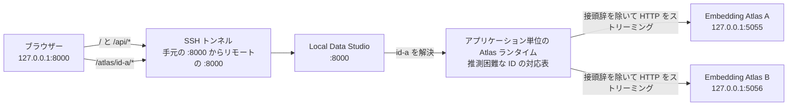

[README_ja.md に戻る](README_ja.md)

# 開発者向けの実装メモ

この文書では、Local Data Studio の主なソースコードの役割と、実装時に維持すべき重要な設計上の条件を説明します。

通常の利用方法だけを知りたい場合は、[README_ja.md](README_ja.md) を参照してください。
この文書は、コードを読みたい人や、機能の追加・修正を行う開発者を対象としています。

## プロジェクト全体の構成

アプリケーション本体は `src/local_data_studio` にあります。
ブラウザーで使用する JavaScript や CSS などの静的 UI ファイルは `src/local_data_studio/static` にあり、Python パッケージにも含まれます。

ワークスペース内の `local_data_studio.toml` が、次の設定をまとめる通常の設定ファイルです。

* データやキャッシュなどのパス
* サーバー設定
* EDA 設定
* Embedding Atlas 設定
* 元のデータファイルからの削除許可
* SQL 生成と翻訳に使用する LLM プロファイル

CLI から起動するときは、`--config` で使用する設定ファイルを明示します。

`.env` は、選択したワークスペースを基準に読み込みます。
主な用途は、API キーなどの認証情報と、そのコンピューターだけに適用する任意の上書き設定です。

実行時の `data`、`cache`、`models/embedder` は、選択したワークスペース、または現在の作業ディレクトリを基準に解決されます。

同じ設定が複数の場所にある場合は、次の順に優先されます。

1. コマンドラインオプション
2. OS の環境変数
3. `local_data_studio.toml`
4. `.env`
5. ワークスペースを基準とした既定値
6. 現在の作業ディレクトリを基準とした既定値

## アプリケーションの入口と API

`src/local_data_studio/app.py` は、Local Data Studio 全体を組み立てる小さなエントリーポイントです。
ここでは、各機能を直接実装するのではなく、API、静的ファイル、バックグラウンド処理などをアプリケーションへ組み込みます。

リクエストモデルと API ルートは `src/local_data_studio/server/api` にあり、主に次の役割へ分割されています。

* データセットへのアクセス
* 分析処理
* バックグラウンドジョブ
* データの変更
* Atlas のリバースプロキシ
* 共通サービス
* 静的ファイルのマウント

ファイルシステム、DuckDB、EDA などの、処理中にスレッドを待たせる可能性がある処理は、FastAPI のスレッドプールで実行します。
一方、ファイルのストリーミングアップロードと Atlas のプロキシ通信は、ほかの通信を止めにくい非同期処理として実行します。

アプリケーションの lifespan は、起動から終了まで共有する次のリソースを管理します。
ここでいう lifespan は、アプリケーションの起動時と終了時に行う処理のまとまりです。

* `JobStore`
* Atlas ランタイム
* プロキシ用 HTTP クライアント
* Atlas 子プロセスを終了する順序

## ブラウザー側の UI

`/app.js` は、ブラウザー側コードの安定した入口として維持します。
実際の処理は、`static/app` 以下にある依存関係を整理した ES モジュールへ分割されています。

ES モジュールは、JavaScript の処理を役割ごとのファイルに分け、必要な機能を相互に読み込む仕組みです。
主に次の責務を分離しています。

* アプリケーションの状態と DOM 要素への参照
* 表示形式の整形
* HTTP 通信
* 画像処理
* LLM の選択
* 翻訳操作とブラウザーメモリ内の結果
* ネイティブ select と互換性を保つカスタムプルダウン表示
* Atlas の操作
* アプリケーション全体の制御

ネイティブの `select` 要素を値と change event の基準として維持しながら、`static/app/selects.js` が約 6 件分のスクロール表示とキーボード操作を提供します。
下端のグラデーションは現在のスクロール位置から決まり、最後の選択肢へ到達すると表示されません。

デスクトップでは、データセット、プレビュー、インスペクターを viewport 内の 3 ペインへ揃え、それぞれの領域内だけをスクロールします。
モバイル／タブレットのブレークポイントでは、document 全体の通常の縦スクロールへ戻し、grid の順序をデータセット sidebar、main workspace、inspector とします。これにより、データセット選択はタイトルバーの直下に残ります。
アイコン操作にはパッケージ内の SVG を使い、`aria-label` とツールチップで操作名を維持します。
上部バーのロゴとタイトルは、`noopener noreferrer` を指定してリポジトリを別タブで開く、ひとつの外部リンクです。
構造化された値は、展開した Preview フィールド、Row Inspector、コード表示ダイアログで同じ JSON のトークン色分けを使用します。

`styles.css` は、CSS ルールの適用順序を維持するため、単一のアセットとして管理します。
すべての JavaScript モジュールと CSS は、配布用の wheel に含めます。

## データセットの読み込み

`src/local_data_studio/server/readers.py` は、既存コードとの互換性を保つための窓口として残します。
形式ごとの実装は、`src/local_data_studio/server/dataset_readers` 以下に分割されています。

行単位で読み込む形式の処理は、さらに次の責務へ分かれています。

* カーソルによるページ移動
* JSONL の読み込み
* CSV／TSV などの区切り形式の読み込み
* 疎な行インデックスの管理

これらの互換窓口が `dataset_readers/line.py` です。
疎な行インデックスとは、すべての行位置を保存するのではなく、一定間隔の位置だけを記録して、目的の場所へ効率よく移動するための索引です。

### JSONL、CSV、TSV

JSONL のメタデータ推論は、あらかじめ決めた行数またはバイト数の上限へ達した時点で停止します。
非常に長い 1 行が含まれている場合も、スキーマ推論に残されたバイト数を超えて読み込みません。

JSONL、CSV、TSV のプレビューでは、ファイルのフィンガープリントに対応づけた疎な行インデックスと、バイト位置またはページトークンを使用します。
フィンガープリントは、同じファイルの同じ状態かどうかを判定するための識別情報です。

完成したインデックスは再利用します。
インデックス作成途中のチェックポイントは、複数件をまとめたトランザクションとして保存します。

CSV／TSV のスキーマ推論、プレビュー、検索、Raw 表示には、長いフィールドにも対応する共通パーサーを使用します。

### Parquet

Parquet のスキーマは、ファイル本体をすべて走査せず、フッターに保存されたメタデータだけから読み込みます。

プレビューと Raw 表示では、一度に読み込む量を制限したレコードバッチを使用します。
従来のオフセット指定との互換処理でも、行を先頭から 1 行ずつ走査せず、行グループのメタデータを使用します。

## カラム統計

`src/local_data_studio/server/stats.py` は、既存コードとの互換性を保つための窓口として残します。
実際の処理は `src/local_data_studio/server/column_stats` 以下に分割されています。

ここでは、主に次の処理を分離しています。

* 値の型推論
* 列ごとの集計
* DuckDB を使った処理全体の制御

サンプル行は固定サイズのバッチで取得し、そのまま列ごとの集計器へ渡します。
行全体のデータと、そこから作った列ごとのコピーを同時に保持しないことで、不要なメモリ使用を避けます。

## SQL の実行

SQL 実行は `src/local_data_studio/server/sql.py` に集約しています。

このモジュールは、主に次の処理を担当します。

* 読み取り専用 SQL であることの検証
* DuckDB のタイムアウトやメモリ上限などのリソース制限
* バックグラウンドジョブの協調的キャンセル

協調的キャンセルとは、処理を外部から強制終了するのではなく、処理側が安全な区切りでキャンセル要求を確認して終了する方式です。

## LLM によるテキスト生成

SQL 生成と手動翻訳では、LiteLLM Python SDK を遅延読み込みする共通アダプターを使用します。
遅延読み込みとは、その機能が実際に必要になるまでライブラリを読み込まない方式です。

関連モジュールの役割は次のとおりです。

* `server/llm_profiles.py`

  * サーバー管理の LLM モデルプロファイルと、SQL／翻訳の利用可否を検証します。
* `server/llm_prompt.py`

  * プロバイダーに依存しない 1 件のユーザーメッセージを作成します。
  * LLM が生成した SQL を検証します。
* `server/llm_client.py`

  * 共通の補完リクエストを送信します。
* `server/llm_service.py`

  * 使用するプロファイルの選択と、SQL 生成処理全体の制御を担当します。

LLM プロバイダーから返されたエラー本文や認証情報は、API レスポンスへ含めません。

### 手動翻訳

翻訳は、ほかの長時間処理と同じ、キャンセル可能な `JobStore` の仕組みを使って実行します。
入力として受け付けるのは、ブラウザーの現在のプレビューページへ読み込まれている JSON 値だけです。
翻訳のためにサーバーが元ファイルの行や Raw 値を追加で読み込むことはありません。

翻訳関連モジュールの責務は次のとおりです。

* `server/translation_config.py`

  * 固定の翻訳先言語一覧、TOML で選択する任意の初期翻訳先、リクエスト制限値を管理します。
* `server/translation_values.py`

  * 入れ子の JSON 値をコピーし、自然言語の文字列だけを抽出して、キーや非文字列値を変えずに翻訳を戻します。
* `server/translation_service.py`

  * 翻訳可能なプロファイルの解決、サーバー側での制限再計算、チャンク分割、ID 対応の厳密な検証、不正応答の 1 回だけの再試行、進捗通知を担当します。

原文と翻訳結果はサーバーへ永続化しません。
LiteLLM の同時呼び出し数はプロセス全体の bounded semaphore で制限し、チャンク間と再試行前にキャンセルを確認します。
プロバイダー固有の構造化出力には依存せず、通常の応答テキストを厳密な JSON として解析し、要求した ID と 1 対 1 で一致することを確認します。

`static/app/translation.js` は、モデルと言語の選択、確認画面、ジョブの監視、ブラウザーメモリ内だけのキャッシュを担当します。
キャッシュキーには、データセットの表示方法、ページまたはクエリ条件、行とカラム、原文のフィンガープリント、モデル、翻訳先言語を含めます。
`localStorage` に保存するのはモデルと言語の選択だけで、原文と翻訳結果は保存しません。
`[translation].default_target_language` を指定した場合は、ブラウザーを開いたときの初期選択で最優先されます。未指定の場合は、保存済みの選択、ブラウザー言語の完全一致、ブラウザー言語の基本部分、サーバー既定値（`ja`）、言語一覧の先頭の順に選びます。
ブラウザーとサーバーは、数値だけの構造、bool、バイナリobject、画像・音声と判定できるデータに対して同じ保守的な分類を適用し、翻訳操作の表示と受付を抑止します。
展開フィールドと JSON コード表示は同じ翻訳キャッシュを参照するため、プロバイダーへ再送信せず同じ結果を表示します。JSON コード表示の操作列には上部と右側の余白を確保し、Copy アイコンには隣接する翻訳操作と同じ枠線付きの面を適用します。これにより、密度の高いオーバーレイでもヘッダーから操作を分離し、アイコン操作と文字の操作を整列させます。

## EDA レポート

EDA レポート全体の処理制御は `src/local_data_studio/server/eda_reports.py` が担当します。
プロファイリング設定と、DataFrame を安全に扱える形へ整える処理は `src/local_data_studio/server/eda.py` に分離されています。
session 内で非表示にした行がない EDA では、`load_eda_dataframe()` が pandas の DataFrame を作る前に、読み込み元へ `EDA_ROW_LIMIT` を直接適用します。非表示行がある場合は、除外結果を正しく保つため、行IDを含む既存のrelationを使用します。

生成したレポートは `./cache/eda` に保存します。
キャッシュ容量が上限を超えた場合は、共通の容量管理処理によって古いファイルから削除します。

## Embedding Atlas

`src/local_data_studio/server/atlas.py` は、既存コードとの互換性を保つための窓口として残します。
実際の処理は、`src/local_data_studio/server/atlas_components` 以下へ役割ごとに分割されています。

主な構成要素は次のとおりです。

* 入出力データの取り決め
* モデルの対応状況に応じて処理を選ぶ埋め込みアダプター
* 安全なプロンプトテンプレート
* 画像値の解決
* 必要になるまで読み込みを遅らせる次元削減入力
* 表示用 DataFrame の作成
* 次元削減
* データセットキャッシュ
* Atlas 起動コマンドの構築
* Atlas の起動確認
* ブラウザーから安全に利用できるポートの割り当て
* サブプロセス制御
* Atlas 処理全体の制御

`server/embedder_capabilities.py` は、ローカルモデルのメタデータだけを、読み込み量に上限を設けて検査します。
また、モデルの対応状況に関係する設定情報から、キャッシュの再利用可否を判定するための識別値を作成します。

### サンプリングとメモリ使用量

`ATLAS_SAMPLE` が正の値の場合、SQL による絞り込みと、毎回同じ結果になる行数制限を、pandas の DataFrame を作る前に DuckDB 内で実行します。

エンコーダーは Atlas ジョブごとに 1 回だけ作成し、複数のバッチで再利用します。

テキストのプロンプトは、現在処理しているバッチに必要な分だけ展開します。
画像は、自動的に削除されるディスク上の一時領域へ保存し、現在のバッチに必要な分だけ読み込みます。

`full` モードで次元削減する場合、埋め込みバッチは連結用のリストへためず、最終的な配列へ直接書き込みます。
ただし、`full` モードの UMAP、t-SNE、PCA は、抽出した埋め込み行列全体を必要とします。

`anchor_transform` モードでは、基準となる anchor の埋め込みと、現在処理している transform バッチだけを保持します。

表示値の整形と座標の追加では、画像の URL、パス、`{bytes, path}` などの元の表現を維持します。

同じ入力に対するキャッシュ未生成の処理が同時に要求された場合は、キャンセル可能な 1 回のキャッシュ生成処理を共有します。

### UMAP の再現性

Atlas の UMAP による次元削減では、同じ条件から同じキャッシュ結果を作りやすくするため、乱数シードを固定します。

また、乱数シードを固定した UMAP の実行方式に合わせて `n_jobs=1` を明示します。
これにより、UMAP がスレッド数を上書きしたことを示す警告を防ぎます。

### macOS でのサブプロセス起動

macOS では、子プロセス側の `fork` による `SIGSEGV (-11)` を避けるため、Atlas のサブプロセス起動が Python の `posix_spawn` 経路を使用するように制約しています。

この条件を維持するため、次の実装を変更しないでください。

* Atlas の実行コマンドには絶対パスを使用する
* `Popen` に `cwd` を渡さない
* `close_fds=False` を維持する

### ポートの選択と起動確認

Atlas のポートは、サブプロセスを起動する直前に選択します。

`atlas_components/ports.py` は、次のポートを候補から除外します。

* Chromium が安全上の理由から接続を禁止しているポート
* すでにほかのプロセスが使用しているポート

Atlas 子プロセスは、`127.0.0.1` 上で `--no-auto-port` を付けて起動します。

バックグラウンドジョブのスレッドが所有する同期 HTTPX クライアントは、OS の環境変数に設定されたプロキシを使用しません。
このクライアントで Atlas のページとメタデータ取得先の両方を確認します。

両方が応答できる状態になった後でだけ、アプリケーション単位の Atlas ランタイムへ子プロセスを登録し、`/atlas/{instance_id}/` を返します。

### Atlas のリバースプロキシ

`server/api/atlas_proxy.py` は、登録済み Atlas への HTTP 通信を、Local Data Studio と同じ接続元から中継します。

接続先は、ASGI の `raw_path` と `query_string` から再構築します。
プロキシ専用の hop-by-hop ヘッダーと認証情報は転送せず、HTTP の `Range` ヘッダーと、転送可能なレスポンスヘッダーは維持します。

Parquet レスポンス全体をメモリへためず、`aiter_raw()` が返す生のバイト列を順次ストリーミングします。

アプリケーションの lifespan が所有する非同期 HTTPX クライアントには、次の制約があります。

* `trust_env=False` とし、環境変数のプロキシ設定を使わない
* リダイレクトを自動で追跡しない
* バックグラウンドジョブのスレッドから使用しない

### Atlas ランタイム

`atlas_components/runtime.py` は、準備中と実行中の Atlas 子プロセス数を `ATLAS_MAX_INSTANCES` で制限します。

`Popen.poll()` を使って、登録したプロセスと現在のプロセスが同じであること、およびプロセスが動作中かどうかを確認します。
対応する同じ `Popen` が終了した場合だけ、その登録を削除します。

推測困難なインスタンス ID は、利用者が任意の内部ポートを指定することを防ぎます。
ただし、この ID はアプリケーションの認証機能ではありません。

アプリケーションの終了処理が始まった後は、新しい子プロセスの起動と登録を拒否します。

## バックグラウンドジョブ

バックグラウンドジョブは `src/local_data_studio/server/jobs.py` で管理します。

各アプリケーションが所有する `JobStore` は、lifespan の終了時に次の順で停止します。

1. 新しいジョブの受け付けを停止する
2. 実行中の処理へ協調的キャンセルを要求する
3. executor を終了する

executor は、バックグラウンド処理を実際に実行するワーカースレッドを管理する仕組みです。

完了、失敗、キャンセル済みの履歴は最大 256 件だけ保持します。
待機中と実行中のジョブは、履歴数の制限によって削除しません。

API には、ロック内で取得した変更されないスナップショットを返します。
処理中に内容が変わる内部レコードそのものは公開しません。

`/api/jobs/*` から、進捗、キャンセル、結果、エラー状態を確認できます。

## キャッシュの容量管理と安全な書き込み

容量制限によるキャッシュ整理では、ディレクトリごとのロック内で各ファイルを 1 回だけ調査します。
更新時刻が同じファイルが複数ある場合は、パス順で削除対象を決めることで、毎回同じ結果になるようにします。

JSON キャッシュは、次の手順で安全に置き換えます。

1. 一時ファイルへ書き込む
2. 内容をストレージへ反映するために flush する
3. `os.replace()` で既存ファイルと一度に置き換える

この方法により、書き込みが途中で中断しても、正常なキャッシュが不完全なファイルで上書きされることを防ぎます。

## docstring の方針

公開 Python API では、PEP 257 と Google スタイルに従う docstring を使用します。
docstring は、関数やクラスなどの目的や使い方をコード内で説明する文字列です。

ただし、型と名前から明らかな内容を繰り返す必要はありません。
次のような、型や名前だけでは分かりにくい情報を記載します。

* 制約
* 発生し得る例外
* 副作用
* キャンセルの動作
* スレッド安全性
* リソースの所有権

非公開のヘルパー関数は、アルゴリズム、互換性、セキュリティ上の重要な条件を知らないと実装を壊しやすい場合だけ文書化します。

## Atlas のポート構成とプロキシ処理



Local Data Studio とブラウザーを同じコンピューターで使う場合、SSH トンネルは不要です。
同じコンピューターで使う場合も、リモートサーバーで使う場合も、Atlas の子プロセスポートは内部に留まります。

Local Data Studio は Embedding Atlas の MCP／WebSocket モードを有効にしないため、現在のリバースプロキシは HTTP だけに対応します。

Atlas のインスタンス ID と子プロセスの対応表は、アプリケーションプロセス内のメモリに保存します。
複数の Uvicorn worker 間では共有されないため、Uvicorn は 1 worker で起動してください。

## Uvicorn から直接起動する

開発時には、Uvicorn を使ってアプリケーション本体を直接起動できます。

Uvicorn は ASGI サーバーです。
ASGI は、Python の Web サーバーと Web アプリケーションを接続するための共通仕様です。

ここでいう ASGI アプリケーションは、`local_data_studio.app:app` で指定する Local Data Studio のアプリケーション本体を指します。
通常の利用では、この用語を意識する必要はありません。

直接起動する場合も同じプロジェクト設定を使用できるように、シェルで `LOCAL_DATA_STUDIO_CONFIG_FILE` を指定します。

```bash
LOCAL_DATA_STUDIO_CONFIG_FILE=./local_data_studio.toml \
  uv run uvicorn local_data_studio.app:app --reload
```
