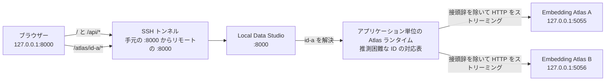

[README_ja.md に戻る](README_ja.md)

# 開発者向けの実装メモ

この文書では、Local Data Studio の主なソースコードの役割と、実装を変更するときに維持すべき重要な設計条件を説明します。

通常の利用方法だけを知りたい場合は、[README_ja.md](README_ja.md) を参照してください。
この文書は、コードの構成を理解したい人や、機能の追加・修正・保守を行う開発者を対象としています。

この文書には、初めて見る技術用語も登場します。
用語はできるだけ初出時に説明していますが、最初からすべてを覚える必要はありません。
変更する機能に関係するセクションと、そこで示されている制約を確認してください。

## プロジェクト全体の構成

アプリケーション本体は `src/local_data_studio` にあります。
ブラウザーで使う JavaScript や CSS などの静的ファイルは `src/local_data_studio/static` にあり、Python パッケージにも含まれます。
これらは、利用者が操作する画面であるユーザーインターフェース（UI）を構成します。

ワークスペース内の `local_data_studio.toml` は、通常のアプリケーション設定をまとめるファイルです。
ここでいうワークスペースは、データ、キャッシュ、ローカルモデル、設定ファイルなどを置く作業用ディレクトリを指します。

`local_data_studio.toml` では、主に次の項目を設定します。

* データやキャッシュなどのパス
* サーバー設定
* EDA（探索的データ分析）の設定
* Embedding Atlas 設定
* 元のデータファイルからの行削除を許可するかどうか
* SQL 生成と翻訳に使用する LLM（大規模言語モデル）プロファイル

コマンドラインから起動するときは、`--config` を使って設定ファイルを明示します。
このような、コマンドラインから操作するための仕組みを CLI（Command-Line Interface）と呼びます。

`.env` は、選択したワークスペースを基準に読み込みます。
主な用途は、API キーなどの認証情報と、そのコンピューターだけに適用する任意の上書き設定です。

実行時の `data`、`cache`、`models/embedder` は、選択したワークスペース、または現在の作業ディレクトリを基準に解決されます。
現在の作業ディレクトリとは、コマンドを実行した時点で開いているディレクトリです。

同じ設定が複数の場所にある場合は、次の順に優先されます。

1. コマンドラインオプション
2. OS の環境変数
3. `local_data_studio.toml`
4. `.env`
5. ワークスペースを基準とした既定値
6. 現在の作業ディレクトリを基準とした既定値

## アプリケーションの入口と API

API（Application Programming Interface）は、ブラウザーなどの別のプログラムからアプリケーションの機能を呼び出すための窓口です。

`src/local_data_studio/app.py` は、Local Data Studio 全体を組み立てる小さなエントリーポイントです。
エントリーポイントとは、アプリケーションを起動するときに最初の入口となるコードです。
このファイルでは各機能を直接実装せず、API、静的ファイル、バックグラウンド処理などをアプリケーションへ組み込みます。

API で受け取るデータの形式を表すリクエストモデルと、各 URL の処理を定義する API ルートは、`src/local_data_studio/server/api` にあります。
主に次の役割へ分割されています。

* データセットへのアクセス
* 分析処理
* バックグラウンドジョブ
* データの変更
* Atlas のリバースプロキシ
* 共通サービス
* 静的ファイルのマウント（特定の URL から配信できるように登録する処理）

ファイルシステム、DuckDB、EDA などの処理は、完了を待つ間に実行中のスレッドを占有することがあります。
このような処理は、FastAPI のスレッドプールで実行します。
スレッドプールは、複数のワーカースレッドを再利用して処理を実行する仕組みです。

一方、ファイルのストリーミングアップロードと Atlas のプロキシ通信は、非同期処理として実行します。
非同期処理では、通信の待ち時間中にほかのリクエストも扱いやすくなるため、一つの通信がほかの接続を止めにくくなります。

アプリケーションの `lifespan` は、起動から終了まで共有するリソースを管理します。
ここでいう `lifespan` は、アプリケーションの起動時と終了時に行う処理のまとまりです。

管理対象には、次のものがあります。

* `JobStore`
* Atlas ランタイム
* プロキシ用 HTTP クライアント
* Atlas 子プロセスを終了する順序

## ブラウザー側の UI

UI は、ボタン、入力欄、表など、利用者がブラウザー上で見たり操作したりする画面部分です。

`/app.js` は、ブラウザー側コードの安定した入口として維持します。
実際の処理は、`static/app` 以下にある、依存関係の順序を整理した ES モジュールへ分割されています。

ES モジュールは、JavaScript の処理を役割ごとのファイルへ分け、必要な機能をファイル間で読み込む仕組みです。
主に次の責務を分離しています。

* アプリケーションの状態と、画面要素を表す DOM への参照
* 表示形式の整形
* HTTP 通信
* 画像処理
* LLM の選択
* 翻訳操作と、ブラウザーのメモリ内に保持する結果
* ネイティブの `select` と互換性を保つカスタムプルダウン表示
* Atlas の操作
* アプリケーション全体の制御

ネイティブの `select` 要素は、選択値と `change` イベントの基準として維持します。
そのうえで、`static/app/selects.js` が約 6 件分の選択肢を表示するスクロール可能な見た目と、キーボード操作を提供します。
下端のグラデーション表示は現在のスクロール位置から決まり、最後の選択肢へ到達すると消えます。

デスクトップでは、データセット一覧、プレビュー、インスペクターを、ブラウザーの表示領域内に 3 ペインで配置します。
各ペインは、それぞれの領域内だけでスクロールします。

メインツールバーは、デスクトップでは高さを抑えた 2 段構成です。
翻訳用の選択欄を上段に、データ検索を下段左側に、行数とページ操作を下段右側に配置します。
画面幅が狭い場合は、ネイティブの `select` 要素が画面外へはみ出さないように、各グループを折り返すか縦方向へ並べます。

モバイル／タブレット用の画面幅へ切り替わると、ページ全体を通常どおり縦にスクロールする構成へ戻します。
CSS Grid の並び順は、データセットのサイドバー、メインの作業領域、インスペクターの順です。
これにより、データセット選択欄はタイトルバーのすぐ下に表示されます。

アイコン操作にはパッケージ内の SVG を使い、`aria-label` とツールチップで操作名を示します。
`aria-label` は、画面読み上げソフトなどへ操作名を伝えるための属性です。

上部バーのロゴとタイトルは、リポジトリを別タブで開く一つの外部リンクです。
リンクには `noopener noreferrer` を指定し、開いたページから元のページを不必要に操作できないようにします。

リストやオブジェクトなどの構造化された値には、展開した Preview フィールド、Row Inspector、コード表示ダイアログのすべてで、同じ JSON の色分けを使用します。

`styles.css` は、CSS ルールの適用順序を安定させるため、単一のファイルとして管理します。
すべての JavaScript モジュールと CSS は、Python パッケージの配布形式である wheel（ホイール）に含めます。

## データセットの読み込み

`src/local_data_studio/server/readers.py` は、既存コードとの互換性を保つための窓口として残します。
形式ごとの実装は、`src/local_data_studio/server/dataset_readers` 以下に分割されています。

行単位で読み込む形式の処理は、さらに次の責務へ分かれています。

* カーソルによるページ移動
* JSONL の読み込み
* CSV／TSV などの区切り形式の読み込み
* 疎な行インデックスの管理

これらの互換窓口が `dataset_readers/line.py` です。
疎な行インデックスとは、すべての行の位置を保存せず、一定間隔の位置だけを記録する索引です。
完全な索引よりも保存量を抑えながら、目的の位置の近くへ効率よく移動できます。

### JSONL、CSV、TSV

JSONL のメタデータ推論は、あらかじめ定めた行数またはバイト数の上限へ達した時点で停止します。
メタデータ推論とは、データの一部を読み、列名や値の型などを推測する処理です。
非常に長い物理行が 1 行だけ含まれている場合も、スキーマ推論に残されたバイト数を超えて読み込みません。

JSONL、CSV、TSV のプレビューでは、ファイルのフィンガープリントに対応づけた疎な行インデックスと、バイト位置またはページトークンを使用します。
フィンガープリントは、同じファイルが同じ状態にあるかどうかを判断するための識別情報です。

完成したインデックスは再利用します。
インデックス作成途中のチェックポイントは、複数件の更新を一つの処理単位にまとめたトランザクションとして保存します。

CSV／TSV のスキーマ推論、プレビュー、検索、Raw 表示には、長いフィールドにも対応する共通パーサーを使用します。
パーサーは、ファイルの文字列を読み取り、アプリケーション内で扱える値へ変換する処理です。

### Parquet

Parquet のスキーマは、ファイル本体をすべて走査せず、ファイル末尾のフッターに保存されたメタデータから読み込みます。

プレビューと Raw 表示では、行を一定量ずつまとめたレコードバッチを使用し、一度に読み込む量を制限します。
従来のオフセット指定との互換処理でも、先頭から 1 行ずつ走査せず、行グループのメタデータを使用します。

## 列（カラム）の統計

`src/local_data_studio/server/stats.py` は、既存コードとの互換性を保つための窓口として残します。
実際の処理は、`src/local_data_studio/server/column_stats` 以下に分割されています。

ここでは、主に次の処理を分離しています。

* 値の型推論
* 列ごとの集計
* DuckDB を使った処理全体の制御

サンプル行は固定サイズのバッチで取得し、そのまま列ごとの集計器へ渡します。
行全体のデータと、そこから作った列ごとのコピーを同時に保持しないことで、不要なメモリ使用を避けます。

## SQL の実行

SQL の実行処理は、`src/local_data_studio/server/sql.py` に集約しています。

このモジュールは、主に次の処理を担当します。

* 読み取り専用 SQL であることの検証
* DuckDB のタイムアウトやメモリ上限などのリソース制限
* バックグラウンドジョブの協調的キャンセル

協調的キャンセルとは、処理を外部から任意の時点で強制終了するのではなく、処理側が安全な区切りでキャンセル要求を確認して終了する方式です。

## LLM によるテキスト生成

SQL 生成と手動翻訳では、LiteLLM Python SDK を遅延読み込みする共通アダプターを使用します。
遅延読み込みとは、その機能が実際に必要になるまでライブラリを読み込まない方式です。
これにより、LLM 機能を使わない起動では、不要な読み込みを避けられます。

関連モジュールの役割は次のとおりです。

* `server/llm_profiles.py`

  * サーバー側で管理する LLM モデルプロファイルを検証します。
  * 各プロファイルで SQL 生成と翻訳を利用できるか確認します。
* `server/llm_prompt.py`

  * LLM プロバイダーに依存しない 1 件のユーザーメッセージを作成します。
  * LLM が生成した SQL を検証します。
* `server/llm_client.py`

  * 共通のテキスト生成リクエストを送信します。
* `server/llm_service.py`

  * 使用するプロファイルを選択します。
  * SQL 生成処理全体を制御します。

LLM プロバイダーから返されたエラー本文や認証情報は、API レスポンスへ含めません。

### 手動翻訳

翻訳は、ほかの長時間処理と同じ、キャンセル可能な `JobStore` の仕組みを使って実行します。
入力として受け付けるのは、ブラウザーの現在のプレビューページへすでに読み込まれている JSON 値だけです。
翻訳のために、サーバーが元ファイルの行や Raw 値を追加で読み込むことはありません。

翻訳関連モジュールの責務は次のとおりです。

* `server/translation_config.py`

  * 固定の翻訳先言語一覧を管理します。
  * TOML で任意に指定する初期翻訳先を管理します。
  * 翻訳リクエストの上限値を検証します。
* `server/translation_values.py`

  * 入れ子になった JSON 値をコピーします。
  * 自然言語の文字列だけを抽出します。
  * キーや文字列以外の値を変えずに、翻訳結果を元の構造へ戻します。
* `server/translation_service.py`

  * 翻訳を許可したプロファイルを解決します。
  * サーバー側でリクエスト制限を再計算します。
  * リクエストをチャンクへ分割します。
  * ID の対応が完全に一致するか検証します。
  * 不正な応答を 1 回だけ再試行します。
  * 進捗を報告します。

原文と翻訳結果は、サーバーへ永続化しません。
LiteLLM の同時呼び出し数は、同時実行数に上限を設けるセマフォ（bounded semaphore）で、プロセス全体にわたって制限します。
キャンセル要求は、チャンク間と再試行前に確認します。

プロバイダー固有の構造化出力機能には依存しません。
通常の応答テキストを厳密な JSON として解析し、要求した ID と 1 対 1 で完全に一致することを確認します。

`static/app/translation.js` は、次の処理を担当します。

* モデルと翻訳先言語の選択
* 大きなリクエストを送信する前の確認画面
* ジョブ状態の監視
* 別の翻訳を開始した場合や、モデルまたは翻訳先言語を変更した場合に、不要になったジョブへ協調的なキャンセルを要求する処理
* ブラウザーのメモリ内だけで使う翻訳キャッシュ

ツールバーには、翻訳の進捗文言や Cancel ボタンを常設しません。
プロバイダーや入力検証のエラーは、共通のエラー画面に表示します。

翻訳キャッシュのキーには、次の情報を含めます。

* データセットの表示方法
* ページまたはクエリの条件
* 行と列の識別情報
* 原文のフィンガープリント
* モデル
* 翻訳先言語

`localStorage` に保存するのは、モデルと翻訳先言語の選択だけです。
原文と翻訳結果は保存しません。

`[translation].default_target_language` を指定した場合は、ブラウザーを開いたときの初期選択で最優先されます。
未指定の場合は、次の順に翻訳先言語を選びます。

1. ブラウザーに保存された選択
2. ブラウザー言語との完全一致
3. ブラウザー言語の基本部分との一致
4. サーバーの既定値である `ja`
5. 登録済み言語一覧の先頭

ブラウザーとサーバーは、数値だけの構造、真偽値、バイナリオブジェクト、画像・音声と判定できるデータに対して、同じ保守的な分類を適用します。
この分類により、翻訳に適さない値では翻訳操作を表示せず、サーバー側でもリクエストを受け付けません。

展開フィールドと JSON コード表示は、同じ翻訳キャッシュを参照します。
そのため、プロバイダーへ再送信せず、両方の画面で同じ結果を表示できます。

JSON コード表示の操作欄には、上側と右側に余白を確保します。
Copy アイコンには、隣接する翻訳操作と同じ枠線付きの背景を適用します。
これにより、情報量の多いオーバーレイでも操作をヘッダーから分離し、アイコン操作とテキスト操作を揃えて表示します。
元の JSON と翻訳後の JSON は、Flexbox を使った一つの縦スクロール領域を共有します。
これにより、モバイル画面でも翻訳結果が見切れず、最後まで確認できます。
この画面のコピー操作にも、ほかのコピー操作と同じ `is-copied` の緑色フィードバックを適用します。

## EDA レポート

EDA レポート全体の処理制御は、`src/local_data_studio/server/eda_reports.py` が担当します。
プロファイリング設定と、DataFrame を安全に分析できる形へ整える処理は、`src/local_data_studio/server/eda.py` に分離されています。
DataFrame は、行と列からなる表形式のデータを Python 上で扱うための構造です。

セッション内で非表示にした行がない EDA では、`load_eda_dataframe()` が pandas の DataFrame を作る前に、読み込み元へ `EDA_ROW_LIMIT` を直接適用します。
非表示行がある場合は、除外結果を正しく保つため、行 ID を含む既存の DuckDB relation（リレーション）を使用します。
relation は、DuckDB で表形式のデータ処理を表すオブジェクトです。

生成したレポートは `./cache/eda` に保存します。
キャッシュ容量が上限を超えた場合は、共通の容量管理処理によって古いファイルから削除します。

## Embedding Atlas

`src/local_data_studio/server/atlas.py` は、既存コードとの互換性を保つための窓口として残します。
実際の処理は、`src/local_data_studio/server/atlas_components` 以下へ役割ごとに分割されています。

主な構成要素は次のとおりです。

* 入出力データの形式と受け渡し規則
* モデルの対応状況に応じて処理を選ぶ埋め込みアダプター
* 安全なプロンプトテンプレート
* 画像として扱う値の解決
* 必要になるまでデータの読み込みを遅らせる次元削減入力
* 表示用 DataFrame の作成
* 次元削減
* データセットキャッシュ
* Atlas 起動コマンドの構築
* Atlas の起動確認
* ブラウザーから安全に利用できるポートの割り当て
* サブプロセスの制御
* Atlas 処理全体の制御

`server/embedder_capabilities.py` は、モデルの重みを読み込まず、ローカルモデルのメタデータだけを検査します。
検査するデータ量には上限を設けます。
また、モデルの対応状況に関係する設定情報から、キャッシュを再利用できるか判断するための識別値を作成します。

### サンプリングとメモリ使用量

`ATLAS_SAMPLE` が正の値の場合、SQL による絞り込みと、毎回同じ結果になる行数制限を、pandas の DataFrame を作る前に DuckDB 内で実行します。

エンコーダーは Atlas ジョブごとに 1 回だけ作成し、複数のバッチで再利用します。

テキストのプロンプトは、現在処理しているバッチに必要な分だけ展開します。
画像は、処理後に自動削除されるディスク上の一時領域へ保存し、現在のバッチに必要な分だけメモリへ読み込みます。

`full` モードで次元削減する場合、埋め込みバッチは連結用のリストへためず、最終的な配列へ直接書き込みます。
ただし、`full` モードの UMAP、t-SNE、PCA は、抽出した埋め込み行列全体を必要とします。

`anchor_transform` モードでは、配置の基準となるデータ（anchor）の埋め込みと、現在配置しているバッチ（transform batch）だけを保持します。

表示値の整形と座標の追加では、画像の URL、パス、`{bytes, path}` など、元の表現を維持します。

同じ入力に対してキャッシュがまだない処理を同時に要求された場合は、複数回生成せず、キャンセル可能な一つのキャッシュ生成処理を共有します。

### UMAP の再現性

Atlas の UMAP による次元削減では、同じ条件から同じキャッシュ結果を作りやすくするため、乱数シードを固定します。

また、乱数シードを固定した UMAP の実行方式に合わせて、`n_jobs=1` を明示します。
これにより、UMAP が設定されたスレッド数を上書きしたことを示す警告を防ぎます。

### macOS でのサブプロセス起動

macOS では、Atlas のサブプロセス起動が Python の `posix_spawn` 経路を使うように制約しています。
これは、親プロセスを複製して子プロセスを作る `fork` が子プロセス側で使われた場合に、`SIGSEGV (-11)` が発生する問題を避けるためです。

> [!IMPORTANT]
> 次の条件は、macOS での Atlas 起動を安定させるための実装要件です。
> 意図を確認せずに変更しないでください。

* Atlas の実行コマンドには絶対パスを使用する
* `Popen` に `cwd` を渡さない
* `close_fds=False` を維持する

### ポートの選択と起動確認

Atlas のポートは、サブプロセスを起動する直前に選択します。

`atlas_components/ports.py` は、次のポートを候補から除外します。

* Chromium が安全上の理由から接続を禁止しているポート
* すでにほかのプロセスが使用しているポート

Atlas 子プロセスは、`127.0.0.1` 上で `--no-auto-port` を付けて起動します。

バックグラウンドジョブのスレッドは、起動確認用の同期 HTTPX クライアントを所有します。
このクライアントは、OS の環境変数に設定されたプロキシを使用しません。
Atlas のページとメタデータ取得先の両方を、このクライアントで確認します。

両方が応答できる状態になった後でだけ、アプリケーション単位の Atlas ランタイムへ子プロセスを登録し、`/atlas/{instance_id}/` を返します。

### Atlas のリバースプロキシ

`server/api/atlas_proxy.py` は、登録済みの Atlas インスタンスへの HTTP 通信を、Local Data Studio と同じ接続元から中継します。
このように、利用者からの通信を内部サービスへ中継する仕組みをリバースプロキシと呼びます。

接続先 URL は、ASGI の `raw_path` と `query_string` から再構築します。
中継する接続区間だけで使う hop-by-hop ヘッダーと認証情報は転送しません。
一方、HTTP の `Range` ヘッダーと、転送可能なレスポンスヘッダーは維持します。

Parquet レスポンス全体をメモリへためず、`aiter_raw()` が返す生のバイト列を、受信した順にストリーミングします。

アプリケーションの `lifespan` が所有する非同期 HTTPX クライアントには、次の制約があります。

* `trust_env=False` とし、環境変数のプロキシ設定を使わない
* リダイレクトを自動で追跡しない
* バックグラウンドジョブのスレッドから使用しない

起動確認用の同期クライアントと、プロキシ用の非同期クライアントは、用途と所有者が異なります。
両者を取り違えないでください。

### Atlas ランタイム

`atlas_components/runtime.py` は、準備中と実行中の Atlas 子プロセス数を、`ATLAS_MAX_INSTANCES` で制限します。

登録時に保持した `Popen` オブジェクトに対して `Popen.poll()` を呼び、そのプロセスが現在も動作しているか確認します。
登録解除は、対応する同じ `Popen` オブジェクトの終了を確認した場合だけ行います。
これにより、別のプロセスを誤って同じ Atlas インスタンスとして扱うことを防ぎます。

推測困難なインスタンス ID は、利用者が任意の内部ポートを指定することを防ぎます。
ただし、この ID はアプリケーションの認証機能ではありません。

アプリケーションの終了処理が始まった後は、新しい子プロセスの起動と登録を拒否します。

## バックグラウンドジョブ

バックグラウンドジョブは、`src/local_data_studio/server/jobs.py` で管理します。

`JobStore` は、ジョブの状態、進捗、結果、エラー、キャンセル要求を管理します。
バックグラウンド処理を実際に実行するワーカースレッドは、executor（実行基盤）が管理します。

各アプリケーションが所有する `JobStore` は、`lifespan` の終了時に次の順で停止します。

1. 新しいジョブの受け付けを停止する
2. 実行中の処理へ協調的キャンセルを要求する
3. executor を終了する

完了、失敗、キャンセル済みのジョブ履歴は、最大 256 件だけ保持します。
待機中と実行中のジョブは、履歴数の制限によって削除しません。

API には、ロックを保持している間に取得した、変更されないスナップショットを返します。
ここでいうスナップショットは、取得時点の状態をコピーしたものです。
処理中に内容が変化する内部レコードそのものは公開しません。

`/api/jobs/*` から、進捗、キャンセル、結果、エラー状態を確認できます。

## キャッシュの容量管理と安全な書き込み

容量制限によるキャッシュ整理では、ディレクトリごとのロックを保持しながら、各ファイルを 1 回だけ調査します。
ロックは、複数の処理が同じデータを同時に変更して競合することを防ぐ仕組みです。

更新時刻が同じファイルが複数ある場合は、パス順で削除対象を決めます。
これにより、同じ条件では毎回同じ順序で削除されます。

JSON キャッシュは、次の手順で安全に置き換えます。

1. 一時ファイルへ書き込む
2. 書き込みバッファーの内容をストレージ層へ渡すために `flush()` する
3. `os.replace()` で既存ファイルと一度に置き換える

この方法により、書き込みが途中で中断しても、正常なキャッシュが不完全なファイルで上書きされることを防ぎます。

## docstring（ドキュメンテーション文字列）の方針

公開 Python API では、PEP 257 と Google スタイルに従う docstring を使用します。
docstring は、関数やクラスなどの目的や使い方を、ソースコード内で説明する文字列です。

ただし、型と名前から明らかな内容を繰り返す必要はありません。
次のような、型や名前だけでは分かりにくい情報を記載します。

* 制約
* 発生し得る例外
* 副作用
* キャンセルの動作
* スレッド安全性
* リソースの所有権

非公開のヘルパー関数は、アルゴリズム、互換性、セキュリティ上の重要な条件を知らないと実装を壊しやすい場合だけ文書化します。
処理内容をコードからそのまま読み取れる場合は、同じ内容を言い換えただけの docstring を追加する必要はありません。

## リリースの自動化

`.github/workflows/release-please.yml` は、変更が `main` へ追加された後に実行されます。
Release Please の Python 向けリリース方式を使い、一つの Release PR を作成または更新します。
`release-please-config.json` はパッケージと tag の形式を定義し、
`.release-please-manifest.json` は最後に公開した version を記録します。
Release PR は、`pyproject.toml` と `CHANGELOG.md` を同時に更新します。

Release PR をマージすると、Release Please が `v<version>` 形式の tag と
公開済みの GitHub Release を作成します。
`.github/workflows/publish.yml` は、その GitHub Release を起点に動作し、tag と
パッケージ version の一致を確認して配布物を作成します。
その後、保護された `pypi` Environment で承認を待ち、Trusted Publishing を使って公開します。
手動実行の `workflow_dispatch` では、選択した branch を TestPyPI へ公開します。

リリースワークフローが使用する GitHub token は、repository secret の
`RELEASE_PLEASE_TOKEN` から受け取り、値そのものはリポジトリへ保存しません。

## Atlas のポート構成とプロキシ処理



Local Data Studio とブラウザーを同じコンピューターで使う場合、SSH トンネルは不要です。
同じコンピューターで使う場合も、リモートサーバーで使う場合も、Atlas の子プロセスポートは内部に留まります。

Local Data Studio は、Embedding Atlas の MCP／WebSocket モードを有効にしません。
そのため、現在のリバースプロキシが扱うのは HTTP 通信だけです。

Atlas のインスタンス ID と子プロセスの対応表は、アプリケーションプロセス内のメモリに保存します。
この対応表は、複数の Uvicorn worker（ワーカープロセス）間では共有されません。
Uvicorn worker は、HTTP リクエストを処理する独立したプロセスです。

> [!IMPORTANT]
> Local Data Studio を Uvicorn で起動するときは、worker（ワーカープロセス）を 1 つにしてください。

## Uvicorn から直接起動する

開発時には、Uvicorn を使ってアプリケーション本体を直接起動できます。

Uvicorn は ASGI サーバーです。
ASGI は、Python の Web サーバーと Web アプリケーションを接続するための共通仕様です。

ここでいう ASGI アプリケーションは、`local_data_studio.app:app` で指定する Local Data Studio のアプリケーション本体を指します。
通常の利用では、この用語を意識する必要はありません。

直接起動する場合も同じプロジェクト設定を使用できるように、シェルで `LOCAL_DATA_STUDIO_CONFIG_FILE` を指定します。

```bash
LOCAL_DATA_STUDIO_CONFIG_FILE=./local_data_studio.toml \
  uv run uvicorn local_data_studio.app:app --reload
```

末尾の `\` は、次の行まで同じコマンドが続くことを表します。
上の 2 行は一つのコマンドであり、次のように 1 行で実行しても同じです。

```bash
LOCAL_DATA_STUDIO_CONFIG_FILE=./local_data_studio.toml uv run uvicorn local_data_studio.app:app --reload
```
