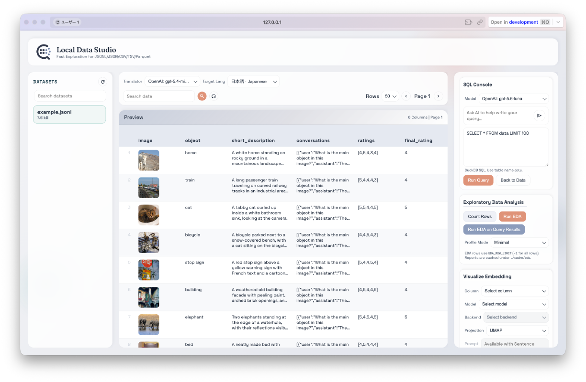
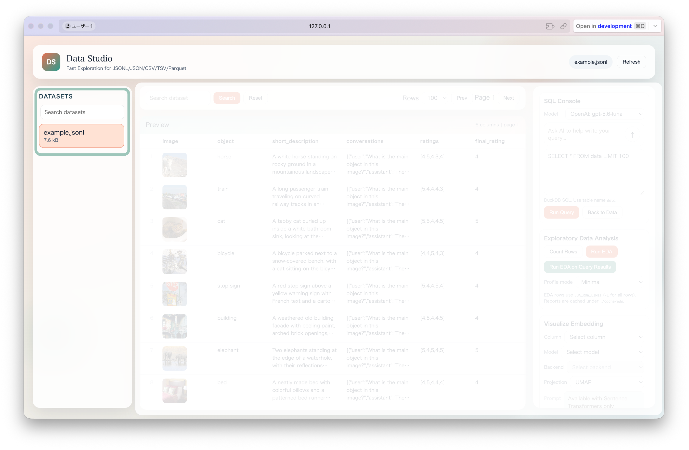
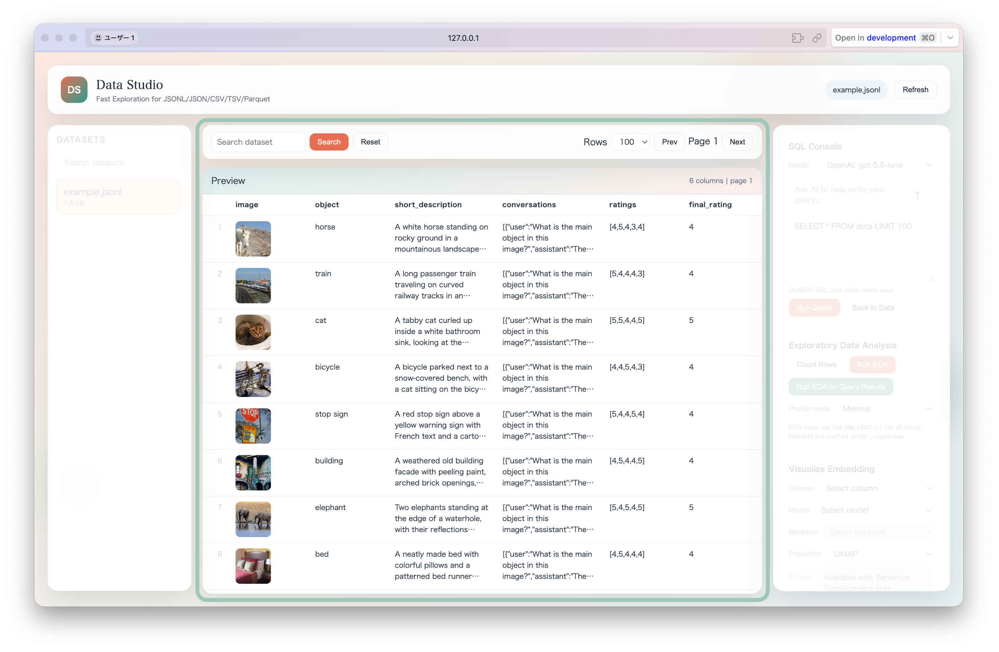
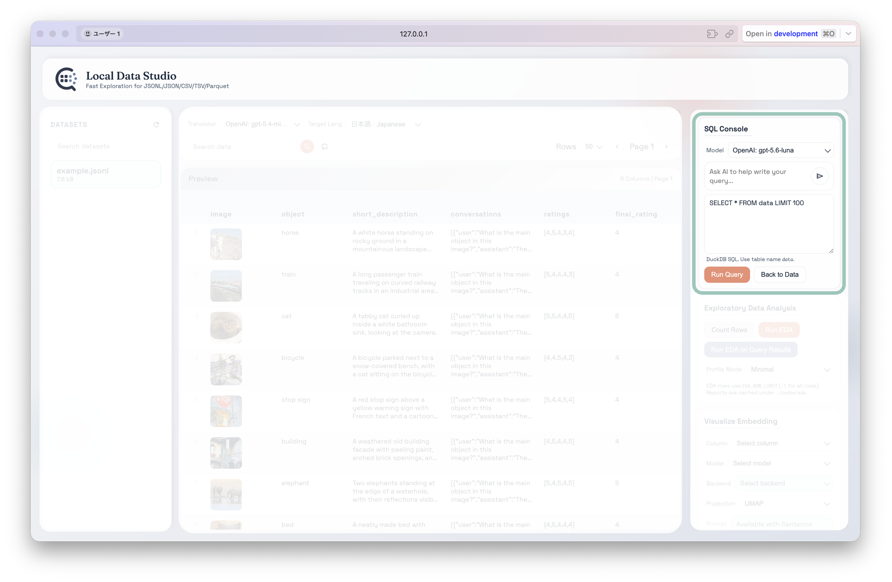
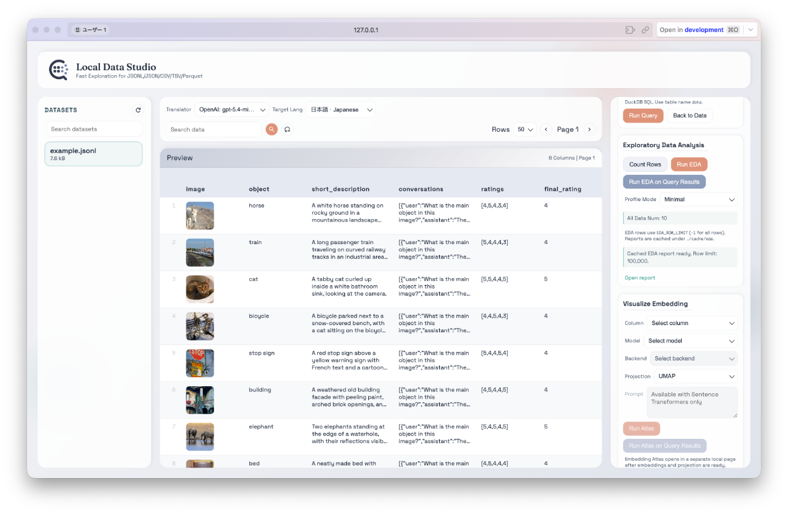
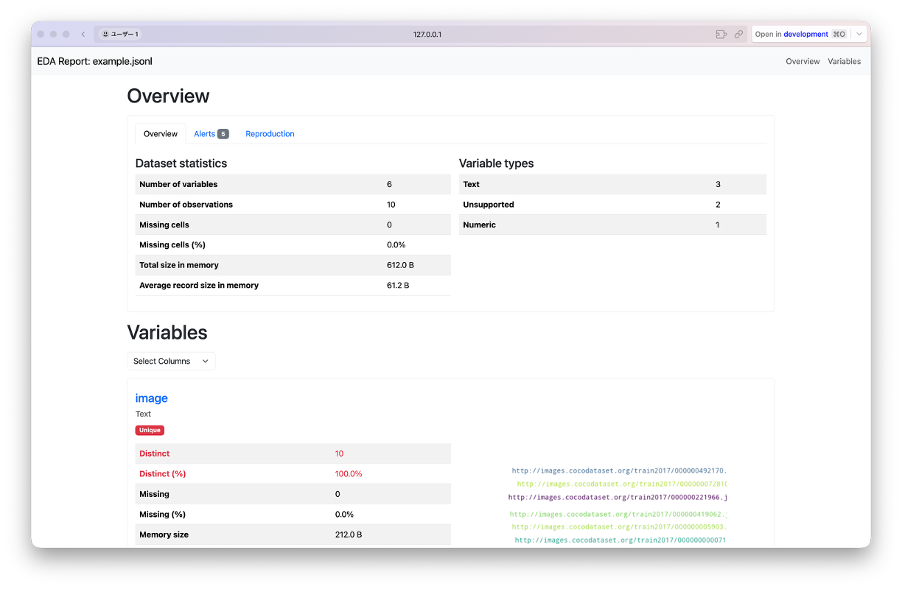
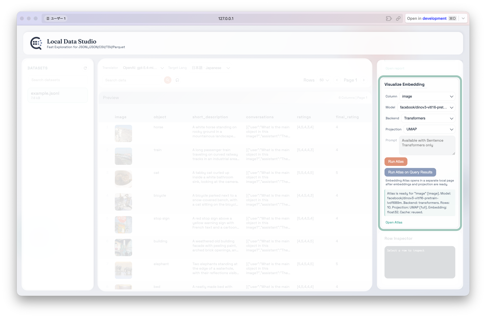
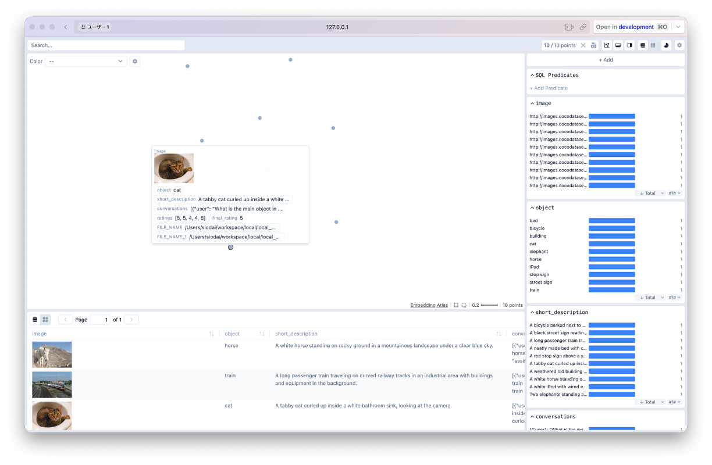
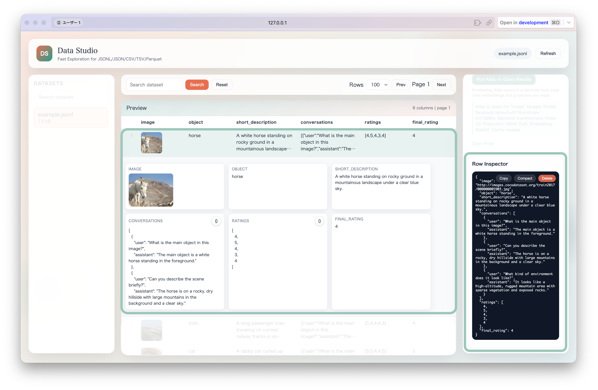
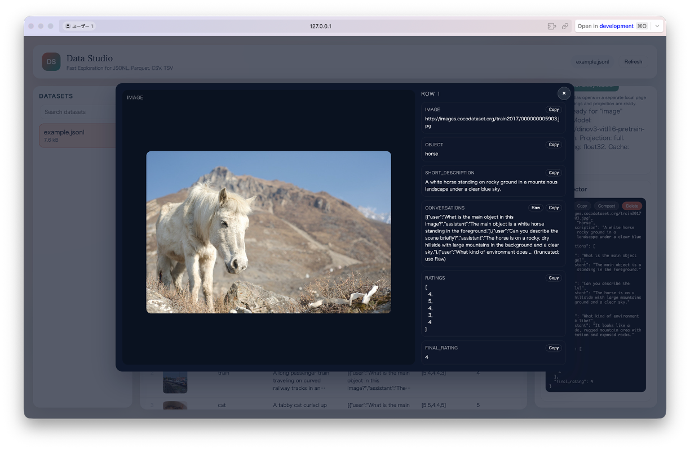

<div align="center">

# Local Data Studio

**GUI Application for Local Dataset Viewing and Analysis**

[English](../README.md) | 日本語
</div>

Local Data Studio は、Huggingface Datasets の [Data Studio](https://huggingface.co/docs/hub/data-studio#data-studio) を参考にして作成された JSONL/JSON/CSV/TSV/Parquet をローカルで閲覧・分析するための Web Viewer です。  
高速プレビュー、(LLM による SQL 補助付き) DuckDB SQL 実行、簡易統計、EDA レポート生成、Embedding Atlas による可視化などを提供します。

<div align="center">

</div>

## 主な特徴

- 大規模データに対応した bounded preview とカーソル形式ページング
- タイムアウト・メモリ制限・大規模スキャン警告を備えた DuckDB SQL コンソール（読み取り専用）
- データセット全体または SQL クエリ結果を対象にした EDA レポート生成（`./cache` にキャッシュ）
- 選択したテキスト/画像カラム、または SQL クエリ結果を対象にした Embedding Atlas 可視化
- Row Inspector（コピー、削除、ハイライト）
- URL、ローカルパス、`{bytes, path}` 形式の画像辞書からの画像レンダリング
- 画像拡大・行内の複数画像ナビゲーション
- ドラッグ&ドロップでアップロード可能
- セッション内の非表示/削除

## 環境構築

1. **リポジトリをクローンまたはダウンロード**  

   ```bash
   git clone git@github.com:Onely7/local_data_studio.git
   cd local_data_studio
   ```

2. **必要なライブラリをインストール**  

   ```bash
   uv sync
   ```

3. **環境変数の設定**  
   `.env` を作成または編集し、環境変数を指定します。

   ```bash
   cp .env.example .env
   ```

   ```bash
   # Data set specification (if both exist, DATA_FILE takes precedence)
   # DATA_FILE=
   DATA_DIR=/local/data/path  # FIXME: data directory path set here (required)
   FILE_SERVE_ROOTS=""
   VIS_EXCLUDE_DIRS=""

   # LLM SQL Generation Settings
   OPENAI_API_KEY=""  # FIXME: OpenAI API Key set here
   OPENAI_BASE_URL=https://api.openai.com/v1
   OPENAI_MODEL=gpt-5.2

   # EDA Settings
   EDA_ROW_LIMIT=10000000
   # EDA_FONT_FAMILY=IPAexGothic
   # EDA_FONT_PATH=fonts/ipaexg.ttf
   EDA_PROFILE_MODE=minimal
   EDA_CELL_MAX_CHARS=5000
   EDA_NESTED_POLICY=stringify

   # Embedding Atlas Settings
   ATLAS_HOST=127.0.0.1
   ATLAS_PORT=5055
   # ATLAS_SAMPLE=5000
   # ATLAS_BATCH_SIZE=16
   ATLAS_CACHE_MAX_BYTES=10737418240
   ATLAS_TEXT_MAX_CHARS=4096
   ATLAS_EMBEDDING_DTYPE=float32
   ATLAS_PROJECTION_MODE=full
   ATLAS_ANCHOR_SAMPLE=10000
   # ATLAS_TEXT_EMBEDDER=sentence-transformers
   # ATLAS_IMAGE_EMBEDDER=transformers
   ATLAS_TRUST_REMOTE_CODE=false

   # Delete Permission
   ALLOW_DELETE_DATA=false
   ```

   環境変数の説明:
   - `DATA_FILE`: 単一ファイルを直接指定します。指定した場合は `DATA_DIR` より優先されます。
   - `DATA_DIR`: データセットの探索対象ディレクトリです（DATA_FILE を使わない場合は必須）。
   - `FILE_SERVE_ROOTS`: ローカル画像プレビューとして配信を許可するディレクトリをカンマ区切りで指定します。
   - `VIS_EXCLUDE_DIRS`: `DATA_DIR` 配下でデータセット探索から除外するディレクトリをカンマ区切りで指定します。
   - `OPENAI_API_KEY`: LLM による SQL 生成を有効化するための API Key です。
   - `OPENAI_BASE_URL`: OpenAI 互換 API のエンドポイントです。
   - `OPENAI_MODEL`: 使用する OpenAI モデル名です。
   - `EDA_ROW_LIMIT`: EDA レポート生成時に読み込む最大行数です。
   - `EDA_FONT_FAMILY`: EDA レポートで使用するフォント名です。(任意)
   - `EDA_FONT_PATH`: フォントファイルへのパスです（指定すると優先されます）。(任意)
   - `EDA_PROFILE_MODE`: `minimal` または `maximal` を指定できます。`minimal` は軽量なレポート、`maximal` は詳細な統計を含む代わりに時間がかかります。
   - `EDA_CELL_MAX_CHARS`: EDA で文字列が長い場合の最大表示文字数です。超過分は `... (truncated)` として省略されます。
   - `EDA_NESTED_POLICY`: ネスト型（list/struct/object/binary など）の扱い方です。`stringify` は文字列化して残し、`drop` は該当列を除外します。
   - `ATLAS_HOST` / `ATLAS_PORT`: ローカル Embedding Atlas ページの host と開始 port です。port が使用中の場合、`embedding-atlas` が別 port を選ぶことがあります。
   - `ATLAS_SAMPLE`: Embedding Atlas に渡す任意のランダムサンプル数です。未設定または `0` の場合は全行を対象にします。
   - `ATLAS_BATCH_SIZE`: 任意の embedding batch size です。未設定または `0` の場合は Embedding Atlas のデフォルトを使用します。
   - `ATLAS_CACHE_MAX_BYTES`: `./cache/atlas` に保存する Embedding Atlas cache 全体の最大容量です。超過時は古い cache file から削除されます。
   - `ATLAS_TEXT_MAX_CHARS`: Atlas の embedding input と cached Atlas parquet output に残すテキストセルの最大文字数です。`0` で省略を無効化します。
   - `ATLAS_EMBEDDING_DTYPE`: projection 前の embedding 配列精度です。`float32` または `float16` を指定できます。
   - `ATLAS_PROJECTION_MODE`: projection 方式です。`full` は全 embedding に対して UMAP を実行し、`anchor_transform` は代表サンプルで UMAP を fit して残りを同じ空間へ transform します。
   - `ATLAS_ANCHOR_SAMPLE`: `ATLAS_PROJECTION_MODE=anchor_transform` の場合に UMAP fit に使う行数です。
   - `ATLAS_TEXT_EMBEDDER` / `ATLAS_IMAGE_EMBEDDER`: 任意の Embedding Atlas embedder backend 名です。
   - `ATLAS_TRUST_REMOTE_CODE`: `true` の場合、Embedding Atlas に `--trust-remote-code` を渡します。
   - `ALLOW_DELETE_DATA`: `false` の場合は実ファイル削除を無効にします（セッション内非表示は可）。

## 実行方法

```bash
uv run uvicorn app:app --reload
```

実行後、ターミナルに以下のようなメッセージが表示されます。

```
INFO:     Will watch for changes in these directories: ['local/data_viewer']
INFO:     Uvicorn running on http://127.0.0.1:8000 (Press CTRL+C to quit)
INFO:     Started reloader process [00000] using StatReload
INFO:     Started server process [00000]
INFO:     Waiting for application startup.
INFO:     Application startup complete.
```

これで Local Data Studio サーバーが立ち上がりました。  
<http://127.0.0.1:8000> にアクセスすることで、Local Data Studio の GUI が表示されます。

## 使い方

1. **DATASETS からファイルを選択**  
   左側の DATASETS リストから閲覧対象を選択します。検索ボックスで絞り込みも可能です。長いファイル名はリスト内で省略表示され、ファイルサイズは最大 3 有効桁で `Bytes`, `kB`, `MB`, `GB`, `TB` の適切な単位に変換して表示されます。  
   

2. **プレビュー / 検索 / ページング**  
   上部の Search でデータ検索、Rows で表示件数、Prev/Next でページ移動ができます。  
   

3. **SQL コンソール**  
   DuckDB SQL で `data` テーブルに対してクエリを実行できます。  
   また、LLM を用いた自然言語による指示から SQL の変換をサポートしています。SQL は単一の `SELECT`/CTE に制限され、タイムアウト、メモリ制限、大規模データセット向けのスキャンリスク検知が適用されます。  
   

4. **EDA レポート**  
   Run EDA を実行するとデータセットのサンプルを対象にしたレポートが生成され、キャッシュされます。**Run EDA on Query Results** を使うと、SQL Console の現在のクエリ結果を対象にした EDA レポートを生成できます。  
   データセット全体のレポートは {ファイル fingerprint, サンプル数, `EDA_PROFILE_MODE`} に基づいてキャッシュされます。クエリ結果のレポートは {ファイル fingerprint, SQL, サンプル数, `EDA_PROFILE_MODE`} に基づいて別キャッシュされます。  
   `EDA_ROW_LIMIT` と UI 側の設定でサンプル数を調整できます。  
    

5. **Embedding 可視化**  
   HuggingFace 形式のローカル encoder model ディレクトリを `models/embedder` 配下に配置します（例: `models/embedder/google/siglip2-base-patch16-224`, `models/embedder/Qwen/Qwen3-Embedding-0.6B`, `models/embedder/Qwen/Qwen3-VL-Embedding-2B`）。`config.json`, `modules.json`, `tokenizer_config.json`, `preprocessor_config.json` などの model marker file を含むディレクトリが Model プルダウンに表示されます。
   **Visualize Embedding** でテキストまたは画像カラムとモデルを選択し、**Run Atlas** を実行するとローカルの Embedding Atlas ページが起動します。**Run Atlas on Query Results** を使うと、SQL Console の現在のクエリ結果を対象に可視化できます。  
   処理はバックグラウンドジョブとして進捗表示され、準備が完了すると **Open Atlas** リンクが表示されます。  
    

6. **Row Inspector / 画像拡大**  
   行をクリックすると詳細パネルで展開されます。長い値はデフォルトで省略表示され、Raw で完全表示に切り替えられます。画像列はクリックで拡大表示できます。画像候補は画像 URL、相対/絶対画像パス、`{ "bytes": ..., "path": ... }` のような辞書から検出され、bytes を優先して表示し、失敗した場合は path を fallback として使用します。  
    

## 注意点

- サポートしているデータフォーマット: `.jsonl`, `.json`, `.csv`, `.tsv`, `.parquet`.
- 大規模データでは検索・EDA の実行に時間がかかることがあります。
- 非常に大きなデータセットでは、対応形式のプレビューに大きな `OFFSET` ではなくカーソル形式の `page_token` を使用します。行数カウント、全体検索、サンプル統計、EDA は進捗確認とキャンセルが可能なバックグラウンドジョブとして実行されます。
- Embedding Atlas ジョブは選択したローカル encoder model で embedding/projection 計算を行うため、時間がかかる場合があります。投影済み parquet input は `./cache/atlas/datasets` に保存され、同じデータ・クエリ・モデル・設定での再実行時は投影済み parquet を再利用して embedding/UMAP 再計算をスキップします。画像表示カラムは元の URL/path/`{bytes, path}` 形式を保持し、encoder 入力変換には hidden embedding input column だけを使います。大規模データで素早く試す場合は `ATLAS_SAMPLE` を指定し、長文テキスト列は `ATLAS_TEXT_MAX_CHARS` で上限を調整し、embedding メモリは `ATLAS_EMBEDDING_DTYPE=float16` で削減できます。`ATLAS_PROJECTION_MODE=anchor_transform` を使うと代表サンプルで UMAP を fit し、残りを transform します。容量上限は `ATLAS_CACHE_MAX_BYTES` で調整してください。
- Qwen3-VL-Embedding model は標準の `transformers` image-feature-extraction 入力契約と異なるため、Sentence Transformers backend に routing されます。画像 bytes の変換は内部 embedding input に限定され、cached Atlas display column は元の値を保持します。
- `models/embedder` 配下のローカル encoder model 実体は Git 管理対象外です。リポジトリにはディレクトリ用の placeholder のみを含め、モデルファイルは各環境で配置してください。
- キャッシュは `./cache/metadata`, `./cache/index`, `./cache/stats`, `./cache/count`, `./cache/search` および EDA レポートファイルに分離され、該当するものはファイルパス・サイズ・更新時刻に基づいて無効化されます。
- `Run EDA on Query Results` では、`rn` や `__rowid` のような補助カラムはレポートから除外されます。
- TB 級の `.json` 配列は推奨しません。高速な閲覧には JSONL または Parquet を推奨します。
- `Delete from file` は実ファイルを書き換えるため、必要に応じてバックアップを推奨します。
- `ALLOW_DELETE_DATA=false` の場合は、セッション内の非表示のみ可能です。（実ファイルは書き換わらない）

## 実装メモ

- 形式別 reader は `server/readers.py` にあります。JSONL/CSV/TSV のプレビューは byte/page token ベースの bounded read と sparse line index を使い、Parquet は row group 全体を読み込まずに必要な batch だけを読みます。
- SQL 実行は `server/sql.py` に集約され、読み取り専用 SQL の検証、DuckDB リソース制限、バックグラウンドジョブの協調キャンセルを扱います。
- EDA レポートの orchestration は `server/eda_reports.py`、profiling 設定と DataFrame sanitization は `server/eda.py` に分離されています。
- Embedding Atlas の起動 orchestration は `server/atlas.py` にあり、`models/embedder` 配下のローカルモデル検出、選択カラムのサンプルからの text/image modality 推定、投影済み parquet cache の作成/再利用、`embedding-atlas` CLI の起動、進捗追跡、ローカル URL 返却、`server/atlas_cache.py` 経由の Atlas cache 容量管理を行います。Cache pruning は古いファイルから削除しつつ、現在の Atlas 起動で必要な parquet artifact は保護します。
- Atlas の UMAP projection は cache artifact の再現性のため固定 seed を使い、UMAP の seeded execution mode に合わせて `n_jobs=1` を明示することで thread override warning を出さないようにしています。
- macOS では child-side fork による `SIGSEGV (-11)` を避けるため、Atlas subprocess 起動を Python の `posix_spawn` path に乗る形に固定しています。Atlas command は絶対パスを使い、`Popen` に `cwd` を渡さず、`close_fds=False` を維持してください。詳細は [SIGSEGV 障害ログ](atlas_sigsegv_incident_log_ja.md) を参照してください。
- バックグラウンドジョブは `server/jobs.py` で管理され、`/api/jobs/*` 経由で進捗、キャンセル、結果、エラー状態を確認できます。

## Contribution

- バグ報告・機能提案は Issue からお願いします。
- コードの品質管理には pre-commit を使用しており、`uv run pre-commit run --all-files` (あるいは `uvx pre-commit run --all-files`) を実行することで、以下のコマンド実行に相当するフォーマット / Lint / 型チェックが実施されます:
  - `uv run ruff format` (あるいは `uvx ruff format`)
  - `uv run ruff check` (あるいは `uvx ruff check`)
  - `uv run pyrefly check` (あるいは `uvx pyrefly check`)
- 上で指摘された全てのエラーを解消した後に、コミットするようにしてください。

## 謝辞

- [Dataset viewer (Huggingface)](https://github.com/huggingface/dataset-viewer): UI/機能設計の参考にしました。
- [Zarque-profiling](https://github.com/crescendo-medix/zarque-profiling): EDA レポート生成に利用しています。
- [Embedding Atlas](https://github.com/apple/embedding-atlas): Embedding のインタラクティブな可視化に利用しています。

## ライセンス

本リポジトリは MIT License の下で公開されています。
